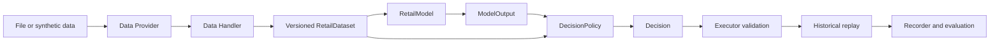
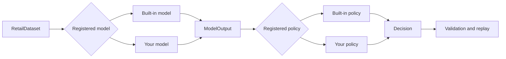

# instant-retail-brain

[English](README.md) | [Chinese](README.zh-CN.md)


A systematic, extensible decision pipeline for intelligent replenishment in instant-retail systems.

`instant-retail-brain` shows how a retail system can move from data input to an auditable replenishment decision without depending on a specific platform. Users can inject business data through data adapters, replace forecasting models and operating policies through a pluggable registration mechanism, and reuse data-quality checks, constraint validation, historical replay, result recording, and evaluation components as they build a system for their own operations.

The project is a runnable reference implementation for technical evaluation, algorithm experiments, solution discussions, and customer-specific implementation work. It uses synthetic data and does not include customer connectors, credentials, confidential rules, or automatic production writes.


## Run It in 60 Seconds

```bash
python -m venv .venv
# Windows: .venv\Scripts\activate
python -m pip install -e ".[test]"
python -m ird demo
```

The command uses deterministic synthetic data and prints a complete JSON run record. This condensed excerpt shows the main result:

```json
{
  "model": "moving_average",
  "policy": "safety_stock",
  "accepted_decisions": 2,
  "metrics": {
    "ordered_units": 27.38,
    "fill_rate": 0.641,
    "committed_spend": 101.24
  }
}
```

## How It Fits Together

The repository provides a compact example that can be run locally:



`business_unit_id`, `store_id`, and `node_id` identify the operating entity, sales store, and fulfillment node. Their identities and inventory responsibilities remain separate even though the sample uses a one-to-one store-node relationship.

It is designed to work with authorized data from ERP, WMS, OMS, POS and retail platforms. It does not replace those systems, use private platform APIs, or include real sensitive data.

## What the Repository Includes

| Area | Included here | Customer implementation |
|---|---|---|
| Data input | Synthetic data and file input | Connect authorized ERP, WMS, OMS, POS, and financial sources |
| Entity structure | Separate operating entity, store, and fulfillment node | Match the customer's organization and fulfillment network |
| Forecasting | Moving average, Holt trend, covariate quantiles, optional LightGBM | Retrain, validate, and monitor against customer data |
| Decisions | Replenishment, assortment, expiry pricing, and store risk examples | Adjust operating rules, permissions, and financial definitions |
| Validation | Quantity, spending, duplicate, and approval checks | Add customer-specific operating and financial checks |
| Evaluation | Historical inventory replay, metrics, and run records | Add scenario simulation, shadow runs, rollout, and online monitoring |
| Extension | Model and policy registration in Python | Add connectors, models, policies, scenarios, and metrics as needed |

## Project Origin

The project grew out of a customer consultation and preliminary research into instant-retail decision problems. The recurring ideas were organized into a framework that is easy to extend, so data formats, forecasting models, decision policies, replay, and approval records can be changed independently. This repository contains reusable code structures and synthetic examples rather than customer data, confidential rules, or a customer-specific implementation.

## Project Ideas

The repository contains a compact example flow. A real implementation should be changed to fit the customer's systems, data definitions, operating processes, and risk controls. The main ideas are:

- Establish a platform-neutral retail data layer for authorized order, product, inventory, purchasing, fulfillment, settlement, and financial data.
- Keep data processing, models, operating policies, constraint checks, human approval, external execution, and outcome evaluation in separate modules.
- Accommodate both configuration-driven standard workflows and code-driven component extensions.
- Move from historical replay and scenario simulation to shadow runs, human approval, limited store rollout, and controlled online execution as risk increases.
- Record data versions, quality status, model parameters, policy constraints, human decisions, execution receipts, and business outcomes.
- Extend data connectors, models, operating policies, simulation scenarios, and evaluation metrics through consistent input and output formats.
- Constrain automated decisions with data quality, contribution margin, inventory capital, and cash-flow requirements.
- Keep model recommendations explainable, operating actions rejectable, and runtime policies auditable and reversible.

Not everything listed above is implemented in this example. The repository currently provides file and synthetic data input, Model and Policy replacement in code, local replay, approval checks, and run recording. Full retail data connectors, configuration-based workflows, Scenario and metric loading, contribution-margin and cash-flow checks, shadow runs, staged rollout, online execution, and rollback should be added in a customer project.

## Try More Configurations

```bash
python -m ird demo --model covariate_quantile --policy quantile_replenishment
python -m pip install -e ".[lightgbm,test]"
python -m ird demo --model lightgbm --policy quantile_replenishment
python examples/advisory_demo.py
python examples/custom_policy.py
python -m unittest discover -s tests -t . -v
```

The demo uses deterministic synthetic data and prints a JSON run record containing separate decision-state and evaluation snapshots, model output, decisions, executor receipts, and evaluation metrics.

`daily_rate` means average demand per day. The ridge and LightGBM examples support a one-day horizon; Holt returns the mean daily rate across its requested horizon. The quantile replenishment policy approximates cumulative demand by treating daily uncertainty as independent.

## Examples

### Baseline replenishment

```bash
python -m ird demo
```

This runs the moving-average model and safety-stock policy. In the JSON result, `decision_state_dataset` identifies the snapshot used to make the decision, while `dataset` identifies the later evaluation data. Each receipt explains whether the executor accepted or rejected its decision.

### Probabilistic replenishment

```bash
python -m ird demo --model covariate_quantile --policy quantile_replenishment
```

This replaces both registered components without changing the existing replay code. `model_output.items[].quantiles` contains P10, P50, and P90 forecasts. The policy selects a service-level quantile and records the cumulative-demand approximation in `action_context`.

### Advisory assortment and expiry decisions

```bash
python examples/advisory_demo.py
```

This prints assortment, pricing, and store-risk decisions. They share the public `Decision` schema but remain advisory and are not sent through the replenishment replay.

## Replace a Model or Policy

The shared interfaces let an experiment keep the existing data preparation, replay, validation, and recording code while replacing only the selected model or policy.



A policy implements `decide`, `explain`, and `describe`, then registers itself with its input, output, parameters, and limitations:

```python
from ird.registry import ComponentAsset, register_policy

register_policy(
    "my_policy",
    MyPolicy,
    ComponentAsset(
        "policy",
        "my_policy",
        "0.1.0",
        "ModelOutput+BusinessState+DecisionConstraints",
        "Decision",
        ("my_parameter",),
        "State the conditions where this policy should not be used.",
    ),
)
```

Models follow the same pattern with `fit`, `predict`, `describe`, and `register_model`. See the complete [custom policy example](examples/custom_policy.py) and the public [component interfaces](src/ird/interfaces.py).

```bash
python examples/custom_policy.py
```

The example prints the registered policy metadata, including its parameters and stated limitation.

## Framework Zoo

Built-in models:

- `moving_average`: transparent point-forecast baseline.
- `holt_trend`: double exponential smoothing for local level and trend.
- `covariate_quantile`: ridge regression using time-available covariates with P10/P50/P90 output.
- `lightgbm`: optional global gradient-boosted model using calendar, covariate, lag, and rolling features with point and quantile outputs.

Built-in policies:

- `safety_stock`: point-forecast replenishment baseline.
- `quantile_replenishment`: service-level order-up-to policy using forecast quantiles.
- `risk_adjusted_assortment`: advisory SKU retention score.
- `expiry_markdown`: advisory markdown and price recovery bounded by cost/regular-price limits.
- `store_risk`: store/node risk aggregation across shortage, expiry, and margin pressure.

The baseline CLI accepts replenishment policies only. Assortment and pricing policies use the same `Decision` schema but require task-specific replay and customer approval rules before real use. The executor rejects approval-required decisions unless a structured approval record is supplied.

Further reading:

- [Architecture](docs/architecture.md)
- [Demand covariates and probabilistic forecasting](docs/demand_covariates_and_probabilistic_forecasting.md)
- [Model and algorithm selection guide](docs/models/model_and_algorithm_selection_guide.md)
- [Why stores and fulfillment nodes must be separate](docs/articles/why-stores-and-fulfillment-nodes-must-be-separated.md)
- [How probabilistic forecasting drives replenishment](docs/articles/probabilistic-forecasting-for-replenishment.md)
- [Replacing the demand model with LightGBM](docs/articles/replacing-the-demand-model-with-lightgbm.md)
- [Chinese README](README.zh-CN.md)
- [Contributing](CONTRIBUTING.md)
- [Security](SECURITY.md)

## Layout

```text
instant-retail-brain/
├── src/ird/                 # Python package
├── data/                    # exchange schemas and safe samples
├── examples/                # runnable examples
├── docs/                    # architecture and technical guides
└── tests/                   # focused unit, integration, and schema tests
```

## Intended Use

This repository shows how the modules work together and how algorithms can be replaced through probabilistic forecasting, replenishment, assortment, expiry-pricing, price-recovery, and store-risk examples. It is not a production system and must be adapted to each customer's data, financial definitions, store/node network, permissions, demand elasticity, and risk controls. No real connector, credential, customer data, platform private API, dashboard, or automatic external write is included.

Read the full [disclaimer](DISCLAIMER.md) before using this project in a real business.

## Contact

Questions, suggestions, and extension discussions are welcome at [aoezhb@gmail.com](mailto:aoezhb@gmail.com).
