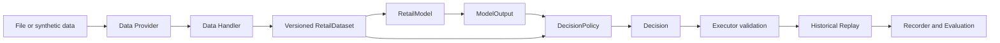

# instant-retail-brain

[English](README.md) | [Chinese](README.zh-CN.md)


An extensible, testable, and auditable replenishment decision pipeline for instant-retail and front-warehouse operations.

Open-source implementations already exist for demand forecasting, quantile prediction, safety stock, and inventory optimization. Intelligent-replenishment projects still often fall short because the difficult part is not finding another algorithm. It is building a systematic process that connects data definitions, model selection, inventory state, operating constraints, approvals, execution, and outcome evaluation.

`instant-retail-brain` is an engineering exploration of that problem. It organizes replaceable algorithm components into a decision pipeline that can be validated, rejected, replayed, and audited.

> *War is too important to be left to the generals.*

If this direction resonates with you, or if you disagree with its definitions, boundaries, or implementation choices, feedback at [aoezhb@gmail.com](mailto:aoezhb@gmail.com) is welcome.


## Run It in 60 Seconds

```bash
python -m venv .venv
# Windows: .venv\Scripts\activate
python -m pip install -e .
python -m ird demo
```

The command uses deterministic synthetic data and prints a JSON run record containing dataset versions, model and policy metadata, constraints, approvals, execution receipts, and evaluation metrics.

```json
{
  "aggregate": {
    "forecast_p50": 8.48,
    "forecast_p90": 8.88,
    "recommended_order_qty": 17.96,
    "expected_cost": 71.84,
    "stockout_risk": 0.5086,
    "approval_required": false,
    "constraint_status": "passed"
  },
  "items": [{
    "sku_id": "sku-milk",
    "forecast_p50": 5.36,
    "forecast_p90": 5.63,
    "recommended_order_qty": 17.96,
    "expected_cost": 71.84,
    "decision_id": "ed62f9be-fcf4-5142-8b5a-7459bf8e96ac"
  }, {
    "sku_id": "sku-water",
    "forecast_p50": 3.12,
    "forecast_p90": 3.25,
    "recommended_order_qty": 0.0,
    "expected_cost": 0.0,
    "decision_id": null
  }]
}
```

These results come from synthetic data and a simplified replay. They demonstrate the data contract and runtime flow, not real business performance or calibrated probabilistic forecasts.

## Why Not Stop at Forecasting?

A forecast does not say whether an order is affordable, operationally valid, or ready for approval. A usable replenishment system must also combine inventory position, lead time, service targets, budgets, minimum quantities, approval rules, and an evidence trail.

| Layer | Responsibility |
|---|---|
| Data Provider / Handler | Inject and validate demand, inventory, and covariate data |
| Model | Estimate future demand and uncertainty |
| Policy | Convert forecasts and inventory state into proposed actions |
| Executor | Accept or reject actions using deterministic constraints |
| Replay / Evaluation | Evaluate decisions against historical data |
| Recorder | Preserve versions, parameters, decisions, approvals, and receipts |

The core replenishment flow has no LLM dependency. P50/P90, order quantities, budget constraints, approvals, and execution checks are produced by deterministic models and rule engines.

## Front-Warehouse Application

Front warehouses, also known as dark stores in some markets, are a common instant-retail fulfillment model and a primary application of this project:

- `business_unit_id`: operating entity;
- `store_id`: online storefront, sales channel, or other demand source;
- `node_id`: front warehouse or other node that holds inventory and fulfills orders;
- `StoreNodeBinding`: service relationship between a demand source and a fulfillment node.

The pipeline can aggregate storefront or channel demand, combine on-hand, inbound, reserved, and backordered inventory with lead and review times, and produce SKU replenishment quantities, expected spend, replay stockout outcomes, and approval requirements.

The current example uses a one-store-to-one-node relationship. One node serving multiple stores, multiple nodes serving one channel, shared inventory, split fulfillment, and dynamic sourcing require customer-specific network and allocation rules.

## Minimal Web Demo

```bash
python -m pip install -e ".[demo,test]"
streamlit run examples/web_demo.py
```

The demo supports:

- built-in synthetic data;
- demand CSV and inventory JSON uploads;
- forecasting-model and replenishment-policy selection;
- aggregate results, SKU details, metrics, and constraint status;
- complete JSON decision-record downloads.

Uploaded data must contain at least two demand dates and is split into training and future evaluation windows. The inventory JSON must represent a historical snapshot on or before the training cutoff; using current inventory against earlier demand would leak future information into the backtest. The CSV and inventory JSON must use matching operating-entity, store, node, and SKU identifiers. See the complete [data contract](data/README.md).

## System Flow



| Capability | Current repository | Customer implementation |
|---|---|---|
| Data input | Synthetic data, CSV, and JSON | ERP, WMS, OMS, POS, and finance connectors |
| Forecasting | Moving average, Holt trend, covariate quantiles, optional LightGBM | Customer-data training, calibration, and drift monitoring |
| Replenishment | Safety-stock and quantile policies | Pack sizes, order calendars, suppliers, and capital rules |
| Validation | Quantity, spend, duplicate, approval, and external-write checks | Customer permissions, financial, and operating constraints |
| Evaluation | Time holdout, inventory replay, metrics, and run records | Rolling backtests, shadow runs, rollout, monitoring, and rollback |
| Extension | Python model and policy registration | Connectors, scenarios, and configuration-driven flows |

## Replace a Model or Policy

Models implement `fit`, `predict`, and `describe`. Policies implement `decide`, `explain`, and `describe`, then register their component metadata.

```python
from ird.registry import ComponentAsset, register_policy

register_policy(
    "my_policy",
    MyPolicy,
    ComponentAsset(
        "policy",
        "my_policy",
        "0.1.0",
        "ModelOutput+BusinessState+DecisionConstraints",
        "Decision",
        ("my_parameter",),
        "State when this policy should not be used.",
    ),
)
```

See [custom_policy.py](examples/custom_policy.py) and the [public component interfaces](src/ird/interfaces.py).

## Built-in Components

Models:

- `moving_average`: transparent moving-average baseline;
- `holt_trend`: local-level and trend model;
- `covariate_quantile`: covariate ridge regression with P10/P50/P90;
- `lightgbm`: optional global point and quantile model.

Policies:

- `safety_stock`: point-forecast safety-stock replenishment;
- `quantile_replenishment`: service-level quantile replenishment;
- `risk_adjusted_assortment`: advisory SKU-retention scoring;
- `expiry_markdown`: expiry markdown and price-recovery advice;
- `store_risk`: store and node risk aggregation.

```bash
python -m ird demo --model moving_average --policy safety_stock
python -m pip install -e ".[lightgbm,test]"
python -m ird demo --model lightgbm --policy quantile_replenishment
python examples/advisory_demo.py
python examples/custom_policy.py
```

## Project Boundaries

This repository is a reference implementation, not a production system that can be deployed directly into customer operations. It does not include customer data, platform credentials, production connectors, multi-tenancy, automatic ordering, a complete permission system, shadow runs, staged rollout, or rollback controls.

Evaluation metrics come from synthetic data and a simplified replay. Real use requires customer definitions for data timing, stockouts and unavailability, inventory valuation, financial constraints, approvals, and risk controls.

LLMs are not part of the current decision path. The research module is limited to possible future work on unstructured supplier information, natural-language queries, exception-ticket grouping, and cross-system information collection. It does not participate in forecasting, replenishment calculations, constraints, approvals, or external writes.

## Further Reading

- [Architecture](docs/architecture.md)
- [Evaluation metrics](docs/evaluation_metrics.md)
- [Demand covariates and probabilistic forecasting](docs/demand_covariates_and_probabilistic_forecasting.md)
- [Model and algorithm selection guide](docs/models/model_and_algorithm_selection_guide.md)
- [Why stores and fulfillment nodes must be separate](docs/articles/why-stores-and-fulfillment-nodes-must-be-separated.md)
- [How probabilistic forecasting drives replenishment](docs/articles/probabilistic-forecasting-for-replenishment.md)
- [Replacing the demand model with LightGBM](docs/articles/replacing-the-demand-model-with-lightgbm.md)
- [LLM positioning](docs/llm-positioning.md)
- [Contributing](CONTRIBUTING.md)
- [Security](SECURITY.md)
- [Disclaimer](DISCLAIMER.md)

## Layout

```text
instant-retail-brain/
├── src/ird/                 # Python package
├── data/                    # exchange schemas and safe samples
├── examples/                # CLI extensions and Web Demo
├── docs/                    # architecture, metrics, and technical articles
└── tests/                   # unit, integration, extension, and schema tests
```

## Contact

Questions, suggestions, and extension discussions: [aoezhb@gmail.com](mailto:aoezhb@gmail.com)
