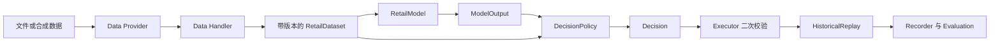
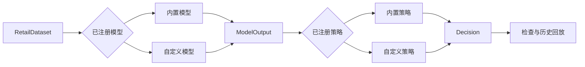

# instant-retail-brain

[简体中文](README.zh-CN.md) | [English](README.md)


一个面向即时零售预测与经营决策的开源、平台中立参考框架。

项目用一套精简且可运行的示例，展示零售数据、需求模型、补货与经营建议、审批检查、历史回放和结果记录如何配合工作。它适合技术验证、算法实验、方案交流以及客户项目的起点，不是可以直接投入生产经营的零售系统。


## 60 秒运行

```bash
python -m venv .venv
.venv\Scripts\activate
python -m pip install -e ".[test]"
python -m ird demo
```

命令使用固定的合成数据，并输出完整的 JSON 运行记录。下面是对主要结果的精简展示：

```json
{
  "model": "moving_average",
  "policy": "safety_stock",
  "accepted_decisions": 2,
  "metrics": {
    "ordered_units": 27.38,
    "fill_rate": 0.641,
    "committed_spend": 101.24
  }
}
```

## 整体流程

项目提供一个精简且可直接运行的示例流程：



`business_unit_id`、`store_id`、`node_id` 分别表示总店/经营主体、门店和履约仓点。即使示例中门店与仓点是一对一，也不会混用其身份与库存职责。

## 当前包含的内容

| 内容 | 当前仓库 | 客户项目 |
|---|---|---|
| 数据输入 | 合成数据和文件输入 | 对接经过授权的 ERP、WMS、OMS、POS 和财务数据 |
| 主体关系 | 分开表示经营主体、门店和履约仓点 | 按客户组织与履约网络调整 |
| 需求预测 | 移动平均、Holt、协变量分位数、可选 LightGBM | 使用客户数据重新训练、验证和监控 |
| 经营决策 | 补货、选品、临期定价和门店风险示例 | 调整经营规则、权限和财务口径 |
| 决策检查 | 数量、金额、重复决策和审批信息检查 | 增加客户自己的经营和财务检查 |
| 效果评估 | 库存历史回放、指标和运行记录 | 增加情景仿真、影子运行、灰度和在线监控 |
| 组件扩展 | 使用 Python 注册模型和策略 | 按需增加连接器、模型、策略、场景和指标 |

## 项目缘起

本项目起源于一次客户咨询，以及围绕即时零售决策问题开展的初步研究。在梳理需求预测、库存决策、经营建议和执行流程的过程中，我们将其中具有共性的思路整理成一套便于扩展的框架，使数据格式、预测模型、决策策略、历史回放和审批记录可以分别修改。本仓库只保留可复用的代码结构和合成示例，不包含客户数据、保密规则或面向特定客户的实现。

## 项目思路

当前仓库只实现一个精简的示例流程。面向客户的实际项目需要结合系统、数据口径、经营流程和风险控制进行修改，主要思路如下：

- 建立平台中立的统一零售数据层，承接经过授权的订单、商品、库存、采购、履约、结算和财务数据。
- 将数据处理、模型、经营策略、约束检查、人工审批、外部执行和效果评估分别实现。
- 同时容纳配置驱动的标准工作流与代码驱动的组件扩展。
- 按风险高低依次开展历史回放、情景仿真、影子运行、人工审批、门店灰度和受控在线执行。
- 完整记录数据版本、质量状态、模型参数、策略约束、人工决定、执行回执和经营结果。
- 通过统一的输入输出格式扩展数据连接器、模型、经营策略、仿真场景和评估指标。
- 以数据质量、贡献毛利、库存资金和现金流要求约束所有自动化决策。
- 保证模型建议可解释、经营动作可拒绝、运行策略可审计且可回退。

以上内容并未全部在本示例中实现。当前仓库包含文件与合成数据输入、通过代码替换 Model 和 Policy、本地回放、审批信息检查和运行记录。完整零售数据连接器、配置文件驱动的流程、Scenario 与指标加载、贡献毛利与现金流限制、影子运行、灰度发布、在线执行和回退方案，应在具体客户项目中补充。

## 尝试更多配置

```bash
python -m ird demo --model covariate_quantile --policy quantile_replenishment
python -m pip install -e ".[lightgbm,test]"
python -m ird demo --model lightgbm --policy quantile_replenishment
python examples/advisory_demo.py
python examples/custom_policy.py
python -m unittest discover -s tests -t . -v
```

演示使用确定性合成数据，并输出包含决策状态快照、评估数据快照、模型输出、策略决策、执行回执和指标的 JSON 运行记录。

## 实例说明

### 基础补货

```bash
python -m ird demo
```

该命令运行移动平均模型和安全库存策略。JSON 中的 `decision_state_dataset` 是生成决策时使用的数据快照，`dataset` 是后续回放使用的评估数据；每条 `receipt` 会说明执行器接受或拒绝决策的原因。

### 概率补货

```bash
python -m ird demo --model covariate_quantile --policy quantile_replenishment
```

该命令通过 Registry 替换模型和策略，不需要修改现有回放代码。`model_output.items[].quantiles` 包含 P10、P50、P90，策略会选择与服务水平对应的分位数，并在 `action_context` 中记录累计需求近似。

### 选品与临期建议

```bash
python examples/advisory_demo.py
```

该示例输出选品、定价和门店风险决策。它们共享公共 `Decision` Schema，但只作为建议，不进入补货回放。

## 替换模型或策略

通过统一接口，可以保留现有的数据处理、回放、检查和记录代码，只替换本次实验所需的模型或策略。



一个策略需要实现 `decide`、`explain` 和 `describe`，然后登记它的输入、输出、参数和使用限制：

```python
from ird.registry import ComponentAsset, register_policy

register_policy(
    "my_policy",
    MyPolicy,
    ComponentAsset(
        "policy",
        "my_policy",
        "0.1.0",
        "ModelOutput+BusinessState+DecisionConstraints",
        "Decision",
        ("my_parameter",),
        "说明该策略不适用的情况。",
    ),
)
```

模型采用相同方式，实现 `fit`、`predict`、`describe` 并调用 `register_model`。完整写法可参考[自定义策略示例](examples/custom_policy.py)和公共[组件接口](src/ird/interfaces.py)。

```bash
python examples/custom_policy.py
```

该示例会输出注册后的策略信息，包括参数和已注明的使用限制。

## Framework Zoo（组件资产库）

内置模型：

- `moving_average`：透明的移动平均基线。
- `holt_trend`：表达局部水平与趋势的双指数平滑。
- `covariate_quantile`：使用时间可用协变量的岭回归，输出 P10/P50/P90。
- `lightgbm`：可选的全局梯度提升模型，使用日历、协变量、滞后和滚动特征，输出点预测与分位数。

内置策略：

- `safety_stock`：点预测安全库存补货。
- `quantile_replenishment`：按服务水平选择分位数的补货策略。
- `risk_adjusted_assortment`：建议型 SKU 保留评分。
- `expiry_markdown`：受成本价和正常价约束的临期折扣与价格恢复建议。
- `store_risk`：聚合缺货、临期和毛利压力的门店/仓点评分。

`daily_rate` 表示日均需求。岭回归与 LightGBM 示例只支持单日预测；Holt 多日预测返回预测期内的平均日需求。分位数补货以每日需求相互独立作为累计不确定性的简化假设。需要审批的决策只有在传入包含审批人和审批时间的审批记录后才会被执行器接受。

基准 CLI 只接受补货类策略。选品和定价策略虽然使用相同的 `Decision` Schema，但在真实使用前需要各自的回放方式与客户审批规则。

## 文件结构

```text
instant-retail-brain/
├── src/ird/                 # Python 包
├── data/                    # 交换 Schema 与安全样例
├── examples/                # 可运行示例
├── docs/                    # 架构与技术指南
└── tests/                   # 聚焦的单元、集成和 Schema 测试
```

## 适用范围

本仓库用于展示各模块如何配合、算法组件如何替换，不是可直接部署到客户业务的生产系统。真实使用前必须按客户的组织关系、门店/仓点网络、数据质量、财务口径、权限、需求弹性和风险规则进行裁剪。

项目不包含真实平台写接口、完整 ERP/WMS/OMS/POS、多租户、实时流平台、自动调价或自动关店。

将本项目用于真实业务前，请阅读完整的[免责声明](DISCLAIMER.zh-CN.md)。

延伸阅读：

- [架构说明](docs/architecture.zh-CN.md)
- [需求协变量与概率预测](docs/demand_covariates_and_probabilistic_forecasting.zh-CN.md)
- [模型与算法选型指南](docs/models/model_and_algorithm_selection_guide.zh-CN.md)
- [门店与仓点为什么必须分开](docs/articles/why-stores-and-fulfillment-nodes-must-be-separated.zh-CN.md)
- [概率预测如何驱动补货](docs/articles/probabilistic-forecasting-for-replenishment.zh-CN.md)
- [如何把需求模型替换为 LightGBM](docs/articles/replacing-the-demand-model-with-lightgbm.zh-CN.md)
- [English README](README.md)
- [参与贡献](CONTRIBUTING.zh-CN.md)
- [安全说明](SECURITY.zh-CN.md)

## 联系方式

欢迎通过邮箱 [aoezhb@gmail.com](mailto:aoezhb@gmail.com) 联系，交流问题、建议和扩展思路。
