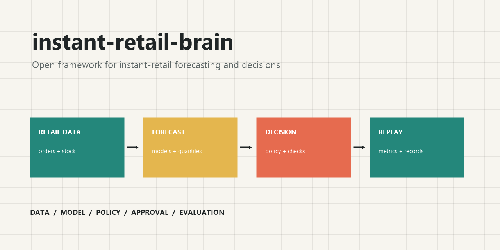
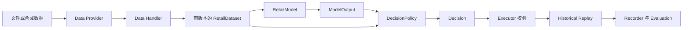

# instant-retail-brain

[简体中文](README.zh-CN.md) | [English](README.md)


面向即时零售前置仓、闪电仓等业务的可扩展、可验证、可审计智能补货决策流水线框架。

需求预测、分位数预测、安全库存和库存优化等算法，基本都能找到开源实现。但智能补货一般做不好的原因，并不是缺少某个算法，而是缺少贯穿数据口径、模型选择、库存状态、经营约束、审批执行和效果评估的系统性流程。

`instant-retail-brain` 是对这一问题的工程化探索。它不试图发明万能算法，而是把可替换的算法组件组织成一条可验证、可拒绝、可回放、可审计的决策流水线。

> 战争太重要了，不能交给将军们。

如果你深以为然，或者对数据定义、业务边界和实现方式有不同看法，欢迎通过邮件 [aoezhb@gmail.com](mailto:aoezhb@gmail.com) 交流和指正。



## 60 秒运行

```bash
python -m venv .venv
.venv\Scripts\activate
python -m pip install -e .
python -m ird demo
```

命令使用固定合成数据，输出包含数据版本、模型、策略、约束、审批、执行回执和评估指标的 JSON 运行记录。

```json
{
  "aggregate": {
    "forecast_p50": 8.48,
    "forecast_p90": 8.88,
    "recommended_order_qty": 17.96,
    "expected_cost": 71.84,
    "stockout_risk": 0.5086,
    "approval_required": false,
    "constraint_status": "passed"
  },
  "items": [{
    "sku_id": "sku-milk",
    "forecast_p50": 5.36,
    "forecast_p90": 5.63,
    "recommended_order_qty": 17.96,
    "expected_cost": 71.84,
    "decision_id": "ed62f9be-fcf4-5142-8b5a-7459bf8e96ac"
  }, {
    "sku_id": "sku-water",
    "forecast_p50": 3.12,
    "forecast_p90": 3.25,
    "recommended_order_qty": 0.0,
    "expected_cost": 0.0,
    "decision_id": null
  }]
}
```

以上结果来自合成数据和简化回放，仅用于展示数据结构与运行链路，不代表真实业务效果或已经完成概率校准。

## 为什么不能只做预测

预测结果不能回答一笔订单是否买得起、能否执行、是否需要审批。可用的补货系统还必须结合库存位置、提前期、服务目标、预算、最小订货量、审批规则和证据链。

| 层次 | 职责 |
|---|---|
| Data Provider / Handler | 注入并校验需求、库存和协变量数据 |
| Model | 估计未来需求和不确定性 |
| Policy | 将预测和库存状态转换为建议动作 |
| Executor | 使用确定性约束接受或拒绝动作 |
| Replay / Evaluation | 在历史数据上评估决策结果 |
| Recorder | 保存版本、参数、决策、审批和回执 |

核心补货流程不依赖 LLM。P50/P90、订货量、预算约束、审批判断和执行检查均由确定性模型与规则引擎完成。

## 前置仓与闪电仓应用

前置仓是即时零售常见的履约形态，在国内也常以闪电仓等业态形式出现，是本项目重点适配的场景：

- `business_unit_id`：经营主体；
- `store_id`：线上门店、销售渠道或需求归属；
- `node_id`：实际持有库存并完成履约的前置仓节点；
- `StoreNodeBinding`：需求来源与前置仓之间的服务关系。

流水线可以汇总门店或渠道需求，结合前置仓现货、在途、预留、欠货、提前期和复核周期，输出 SKU 补货数量、预计金额、回放缺货结果和审批要求。

本项目使用平台中立的数据与接口定义，不隶属于任何即时零售平台或具体的“闪电仓”品牌。

当前示例使用一店一仓关系。一仓多店、多仓服务同一渠道、共享库存、拆单履约和动态寻源，需要在客户项目中补充网络分配与库存归属规则。

## 最小 Web Demo

```bash
python -m pip install -e ".[demo,test]"
streamlit run examples/web_demo.py
```

Demo 支持：

- 使用内置合成数据；
- 上传需求 CSV 与库存 JSON；
- 选择预测模型和补货策略；
- 查看汇总结果、SKU 明细、指标和约束状态；
- 下载完整 JSON 决策记录。

上传数据需要至少两个需求日期，系统按时间切分训练窗口和未来评估窗口。库存 JSON 必须是训练截止日当日或更早的历史快照；如果用当前库存回测更早的需求，会产生未来信息泄漏。CSV 与库存 JSON 必须使用一致的经营主体、门店、仓点和 SKU 标识。完整要求见[数据契约](data/README.zh-CN.md)。

## 系统链路



| 能力 | 当前仓库 | 客户项目仍需补充 |
|---|---|---|
| 数据输入 | 合成数据、CSV 和 JSON | ERP、WMS、OMS、POS 和财务连接器 |
| 需求预测 | 移动平均、Holt、协变量分位数、可选 LightGBM | 真实数据训练、校准、漂移监控 |
| 补货策略 | 安全库存与分位数补货 | 包装规格、订货日历、供应商和资金规则 |
| 约束检查 | 数量、金额、重复、审批和外部写入检查 | 客户权限、财务和操作约束 |
| 评估记录 | 时间留出、库存回放、指标和运行记录 | 滚动回测、影子运行、灰度、监控和回退 |
| 扩展方式 | Python 模型与策略注册 | 数据连接器、场景和配置化流程 |

## 替换模型或策略

模型实现 `fit`、`predict` 和 `describe`；策略实现 `decide`、`explain` 和 `describe`，然后登记组件元数据。

```python
from ird.registry import ComponentAsset, register_policy

register_policy(
    "my_policy",
    MyPolicy,
    ComponentAsset(
        "policy",
        "my_policy",
        "0.1.0",
        "ModelOutput+BusinessState+DecisionConstraints",
        "Decision",
        ("my_parameter",),
        "说明该策略不适用的情况。",
    ),
)
```

完整示例见 [custom_policy.py](examples/custom_policy.py) 和 [公共组件接口](src/ird/interfaces.py)。

## 内置组件

模型：

- `moving_average`：透明的移动平均基线；
- `holt_trend`：表达局部水平与趋势；
- `covariate_quantile`：输出 P10/P50/P90 的协变量岭回归；
- `lightgbm`：可选的全局点预测与分位数模型。

策略：

- `safety_stock`：点预测安全库存补货；
- `quantile_replenishment`：按服务水平选择分位数；
- `risk_adjusted_assortment`：建议型 SKU 保留评分；
- `expiry_markdown`：临期折扣与价格恢复建议；
- `store_risk`：门店和仓点风险汇总。

```bash
python -m ird demo --model moving_average --policy safety_stock
python -m pip install -e ".[lightgbm,test]"
python -m ird demo --model lightgbm --policy quantile_replenishment
python examples/advisory_demo.py
python examples/custom_policy.py
```

## 项目边界

本仓库是参考实现，不是可直接部署到客户业务的生产系统。项目不包含真实客户数据、平台凭证、生产连接器、多租户、在线自动下单、完整权限系统、影子运行、灰度发布或回退控制。

评估指标来自合成数据和简化回放。真实使用前必须重新定义数据口径、时间窗口、缺货与不可售处理、库存计价、财务约束、审批流程和风险规则。

LLM 不是当前主线能力。研究模块只考虑非结构化供应商信息、自然语言查询、异常工单归纳和跨系统信息收集，不参与预测、补货计算、约束、审批或外部写入。

## 延伸阅读

- [架构说明](docs/architecture.zh-CN.md)
- [评估指标口径](docs/evaluation_metrics.zh-CN.md)
- [需求协变量与概率预测](docs/demand_covariates_and_probabilistic_forecasting.zh-CN.md)
- [模型与算法选型指南](docs/models/model_and_algorithm_selection_guide.zh-CN.md)
- [门店与仓点为什么必须分开](docs/articles/why-stores-and-fulfillment-nodes-must-be-separated.zh-CN.md)
- [概率预测如何驱动补货](docs/articles/probabilistic-forecasting-for-replenishment.zh-CN.md)
- [如何把需求模型替换为 LightGBM](docs/articles/replacing-the-demand-model-with-lightgbm.zh-CN.md)
- [LLM 的定位](docs/llm-positioning.zh-CN.md)
- [参与贡献](CONTRIBUTING.zh-CN.md)
- [安全说明](SECURITY.zh-CN.md)
- [免责声明](DISCLAIMER.zh-CN.md)

## 文件结构

```text
instant-retail-brain/
├── src/ird/                 # Python 包
├── data/                    # 交换 Schema 与安全样例
├── examples/                # CLI 扩展与 Web Demo
├── docs/                    # 架构、指标和技术文章
└── tests/                   # 单元、集成、扩展和 Schema 测试
```

## 联系方式

问题、建议和扩展讨论：[aoezhb@gmail.com](mailto:aoezhb@gmail.com)
