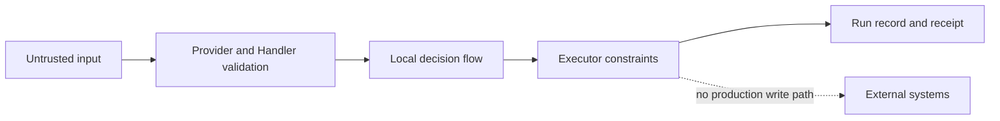

# Security Policy

This repository is a local demo project and does not provide production security controls or external write integrations.

Report suspected vulnerabilities privately to the repository maintainers instead of opening a public issue. Include the affected version, reproduction steps, impact, and any suggested mitigation. Do not include real credentials or customer data in a report.

Only the latest released version receives fixes. Production adopters remain responsible for authentication, authorization, secret storage, data isolation, audit retention, approval workflows, dependency scanning, and rollback controls in their own environment.

[Chinese version](SECURITY.zh-CN.md)
