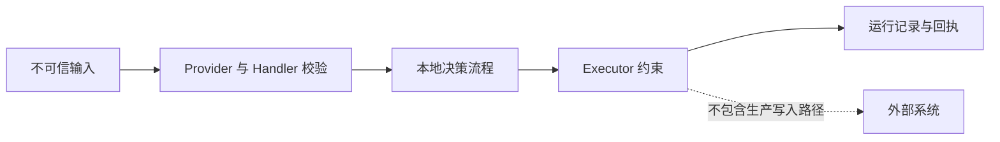

# 安全策略

本仓库是一个本地演示项目，不提供生产级安全控制或外部写入集成。

发现疑似漏洞时，请通过私下渠道报告给仓库维护者，不要先提交公开 Issue。报告应包含受影响版本、复现步骤、影响和建议缓解措施，不要附带真实凭证或客户数据。

只有最新发布版本接收修复。生产采用方仍需在自己的环境中负责认证、授权、密钥保存、数据隔离、审计留存、审批流程、依赖扫描和回退控制。

[English version](SECURITY.md)
