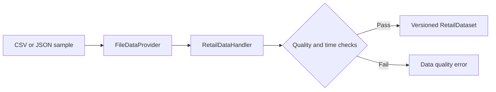

# Data Directory

Only synthetic or explicitly authorized, de-identified data belongs here.

- `schemas/`: platform-neutral JSON Schemas for demand, inventory, covariates, store-node bindings, model output, decisions, approvals, receipts, and run records.
- `sample/`: tiny examples safe to commit to a public repository.

## Web Demo Upload Contract

The Web Demo accepts a demand CSV and an inventory JSON array. Demand data must contain at least two distinct dates so the demo can reserve the latest 20% of dates for future evaluation.

Required demand CSV fields:

`business_unit_id`, `store_id`, `node_id`, `sku_id`, `day`, `demand`

Required inventory JSON fields:

`business_unit_id`, `store_id`, `node_id`, `sku_id`, `available_inventory`, `on_order`, `reserved_inventory`, `backorders`, `unit_cost`, `lead_time_days`, `review_period_days`

For a valid time holdout, each inventory record must include a `snapshot_time` on or before the training cutoff. A current inventory snapshot cannot be combined with earlier demand for historical evaluation because it would leak future information. The demand and inventory files must contain the same item identities.

In a front-warehouse deployment, `store_id` identifies the online storefront, channel, or demand source, while `node_id` identifies the front warehouse or fulfillment node that owns inventory. Do not collapse the two identifiers even when the current relationship is one-to-one.

Covariate records keep `event_time` and `available_time` separately. Future-known plans or forecasts may have an event time after their availability time, but no model may use a record whose `available_time` is later than the dataset snapshot.

Inventory records may carry their own `snapshot_time`; it cannot be later than the dataset snapshot. The samples also include price and expiry fields used by the advisory policies. The Handler derives explicit store-node bindings and rejects demand, inventory, or covariate identities that do not agree across tables.

Never commit platform credentials, customer addresses, real order exports, supplier contracts, or identifiable store data.

[Chinese version](README.zh-CN.md)
