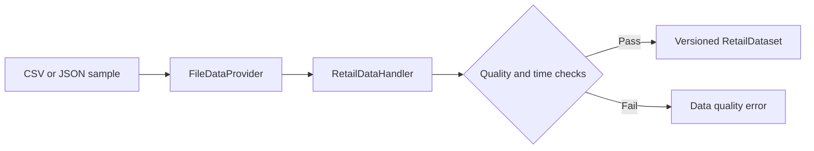

# Data Directory

Only synthetic or explicitly authorized, de-identified data belongs here.

- `schemas/`: platform-neutral JSON Schemas for demand, inventory, covariates, store-node bindings, model output, decisions, approvals, receipts, and run records.
- `sample/`: tiny examples safe to commit to a public repository.

Covariate records keep `event_time` and `available_time` separately. Future-known plans or forecasts may have an event time after their availability time, but no model may use a record whose `available_time` is later than the dataset snapshot.

Inventory records may carry their own `snapshot_time`; it cannot be later than the dataset snapshot. The samples also include price and expiry fields used by the advisory policies. The Handler derives explicit store-node bindings and rejects demand, inventory, or covariate identities that do not agree across tables.

Never commit platform credentials, customer addresses, real order exports, supplier contracts, or identifiable store data.

[Chinese version](README.zh-CN.md)
