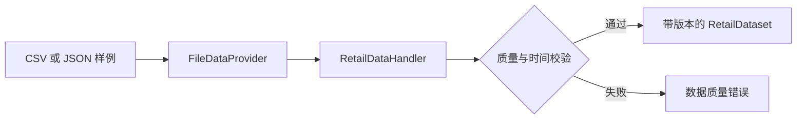

# 数据目录

本目录只允许保存合成数据，或经过明确授权和去标识化处理的数据。

- `schemas/`：与平台无关的 JSON Schema，包括需求、协变量、库存、门店-仓点绑定、模型输出、决策、审批、执行回执和运行记录。
- `sample/`：可以安全提交到公开仓库的小型样例。

## Web Demo 上传契约

Web Demo 接收需求 CSV 和库存 JSON 数组。需求数据必须至少包含两个不同日期，Demo 才能将最后 20% 的日期留作未来评估窗口。

需求 CSV 必填字段：

`business_unit_id`、`store_id`、`node_id`、`sku_id`、`day`、`demand`

库存 JSON 必填字段：

`business_unit_id`、`store_id`、`node_id`、`sku_id`、`available_inventory`、`on_order`、`reserved_inventory`、`backorders`、`unit_cost`、`lead_time_days`、`review_period_days`

为了保证时间留出评估有效，每条库存记录必须包含 `snapshot_time`，且不得晚于训练截止时间。当前库存不能与更早的需求历史直接组合回测，否则会引入未来信息。需求文件和库存文件必须包含完全一致的商品身份。

在前置仓场景中，`store_id` 表示线上门店、渠道或需求来源，`node_id` 表示实际持有库存的前置仓或其他履约节点。即使当前是一店一仓，也不要合并这两个标识。

协变量分别保存 `event_time` 和 `available_time`。计划、预报等未来已知变量可以晚于其数据可用时间发生，但模型不能使用 `available_time` 晚于数据快照的记录。

库存记录可以单独携带 `snapshot_time`，但不能晚于数据集快照。样例还包含经营建议策略所需的售价、正常价和临期天数字段。Handler 会生成明确的门店-仓点绑定，并拒绝需求、库存或协变量之间身份不一致的数据。

禁止提交平台凭证、客户地址、真实订单导出、供应商合同或可识别的门店数据。

[English version](README.md)
