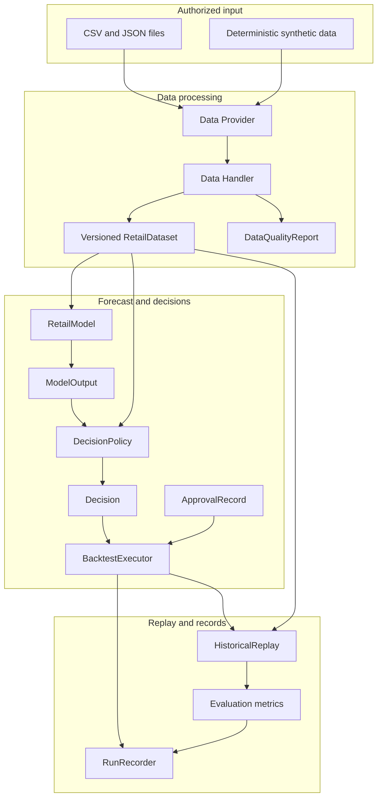
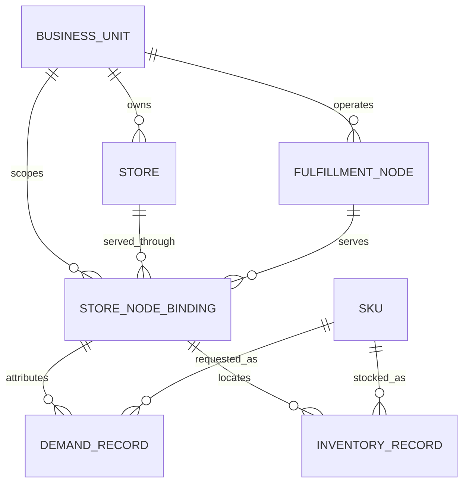
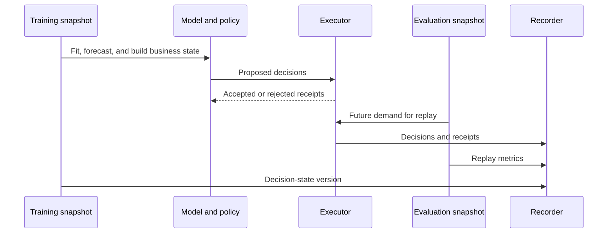
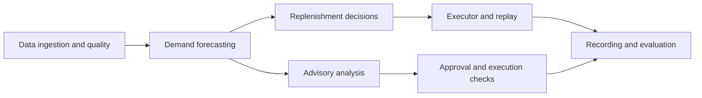
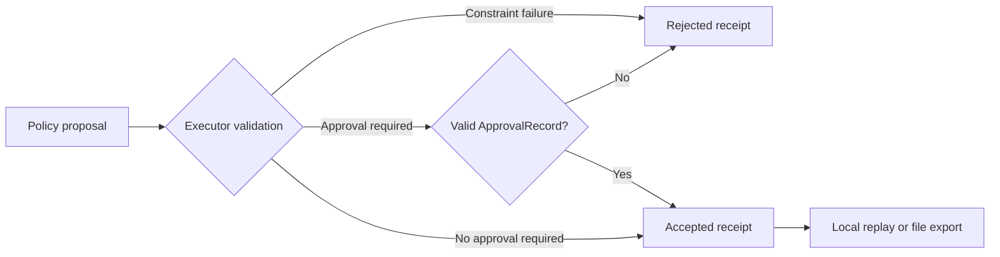

# Project Structure and Runtime Flow

This document describes the modules included in the runnable framework and how they work together. It covers data formats, component interfaces, approval, and execution checks. It does not cover production deployment.

## Component Map

The model produces forecasts only. The policy combines forecasts, inventory state, and limits to produce a `Decision`. The executor checks action types, expiry, `ApprovalRecord` entries, external-write settings, and cumulative batch quantity and spend.

## Business Unit, Store, and Node

`business_unit_id`, `store_id`, and `node_id` remain distinct even when the demo uses one store and one fulfillment node. Every runtime item key includes all three identities plus `sku_id`, preventing equal local IDs from different business units from colliding. The Handler exposes explicit `StoreNodeBinding` records.

To keep the example small, the dataset stores demand and inventory on an attributed store-node service lane. A production network with shared node inventory, split fulfillment, or dynamic sourcing must replace this lane-level attribution with its actual allocation and network-state logic.

## Time Handling and Historical Replay

Each covariate carries `event_time` and `available_time`. Model prediction rejects a dataset snapshot later than the prediction time. Replay takes initial inventory from the decision-state dataset and future demand from the evaluation dataset. The recorder stores both versions.

## Functional Modules

### Data Ingestion and Format Checks

File and synthetic Providers load records without platform-specific business logic. Data Handler validates nonblank identifiers, finite numbers, integer periods, duplicate keys, cross-table identities, snapshot time, and feature availability before producing a versioned `RetailDataset` and its store-node bindings.

### Demand Forecasting

The model layer includes moving average, Holt trend, a time-aware ridge quantile model, and an optional LightGBM global model. `daily_rate` means average demand per day. Ridge and LightGBM support a one-day horizon; Holt returns the mean daily rate over its configured horizon.

### Replenishment Decisions

Safety-stock and quantile replenishment policies combine forecast output with inventory position, lead time, review period, service level, and spending limits. The example treats daily demand as independent when approximating cumulative demand.

### Advisory Analysis

Assortment scoring, expiry markdown and price recovery, and store-risk summaries produce advisory `Decision` objects. They do not enter replenishment replay because assortment, pricing, and risk review require different approval and execution steps.

### Component Registration

Framework Zoo records the name, version, parameters, and input and output formats for Dataset, Model, Policy, and Scenario entries. The Registry can replace Models and Policies. The current code cannot load Scenarios dynamically.

## What the Current Code Includes

The README lists the longer-term ideas. The table below describes what is present in the code and what a real implementation would still need.

| Area | Current code | Work needed for a real implementation |
| --- | --- | --- |
| Retail data | Schemas for demand, inventory, covariates, and store-node bindings | Connectors and field mappings for orders, products, purchasing, fulfillment events, settlement, and finance |
| Module responsibilities | Protocols, schemas, registries, executor, recorder, replay, and metrics each handle one part of the flow | Service layout, deployment, and permissions for the customer's systems |
| Component replacement | Models and Policies can be replaced through code registration | Configuration-based flows and loading for Connectors, Scenarios, and metrics |
| Ways to run | Local historical replay and `ApprovalRecord` checks | Scenario engines, shadow runs, staged rollout, online writes, and rollback |
| Run records | Dataset versions, quality, component parameters, constraints, decisions, approvals, receipts, model output, and evaluation metrics | Long-term storage, access controls, and retention periods |
| Operating limits | Examples for data quality, quantity, spend, service level, approval, and price floors | Customer definitions for contribution margin, inventory capital, and cash flow |
| Decision checks | Reason codes, explanations, rejected receipts, approvals, and run records | Cancellation, compensation, and manual handling for real operating actions |

## Approval and Execution Checks

Approval records preserve the decision ID, result, reviewer, decision time, and comment. Run records include the approvals supplied to the executor. The repository contains no production connector, credential, customer data, private platform API, dashboard, or automatic external write. Customer deployment requires data mapping, financial definitions, network topology, authentication, authorization, approval, audit, monitoring, and rollback design.

[Chinese version](architecture.zh-CN.md)
