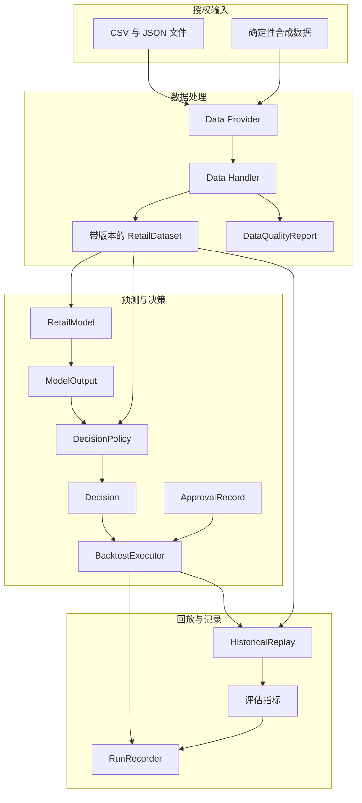
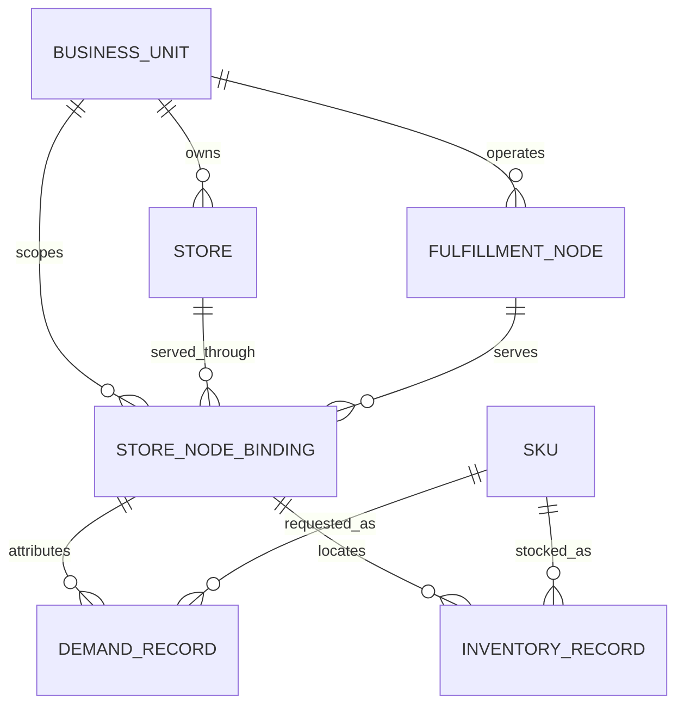
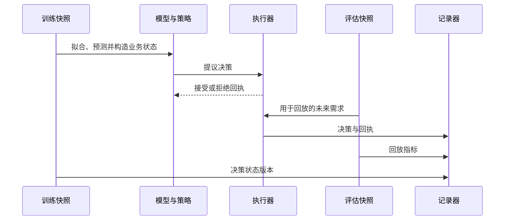
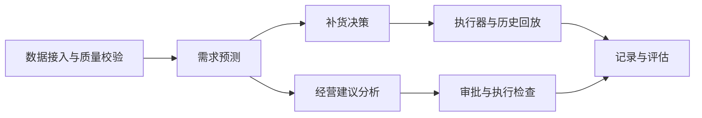
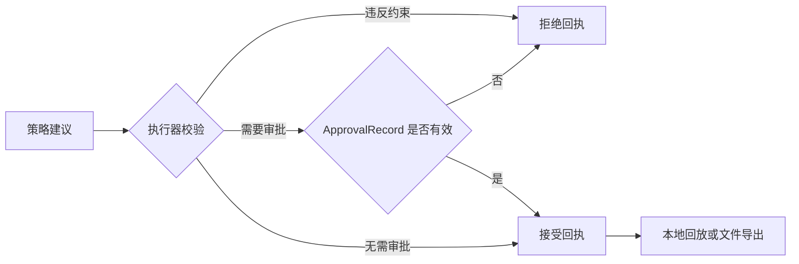

# 项目结构与运行流程

本文说明当前代码包含哪些模块，以及这些模块如何配合。内容包括数据格式、组件接口、审批和执行检查，但不涉及生产部署。

## 组件关系

模型只生成预测。策略结合预测、库存状态和限制生成 `Decision`，执行器再次检查动作类型、有效期、`ApprovalRecord` 审批记录、外部写入设置，以及批次累计数量和金额。

## 经营主体、需求门店与前置仓节点

`business_unit_id`、`store_id`、`node_id` 始终分离。对于典型前置仓业务，`store_id` 表示线上门店、销售渠道或其他需求归属，`node_id` 表示实际持有库存并完成拣货履约的前置仓节点。运行时的每个商品键都包含这三个身份以及 `sku_id`，Handler 还会生成明确的 `StoreNodeBinding`。

为了让示例保持简单，当前数据集按照已经归属到门店-前置仓服务关系的粒度保存需求和库存。真实网络中的一仓多店、共享前置仓库存、多仓服务同一渠道、拆单履约或动态寻源，需要在客户项目中改成实际的分配和网络状态处理。

## 时间处理与历史回放

每个协变量保留 `event_time` 和 `available_time`。当数据集快照晚于预测时点时，模型会拒绝预测。回放的初始库存来自决策状态数据集，未来需求来自评估数据集，记录器同时保存两个版本。

## 功能模块

### 数据接入与格式检查

文件 Provider 和合成数据 Provider 负责加载记录，不承载平台专属业务逻辑。Data Handler 检查非空标识、有限数值、整数周期、重复键、跨表身份、快照时间和特征可用时间，然后生成带版本哈希和门店-仓点绑定的 `RetailDataset`。

### 需求预测

模型层包含移动平均、Holt 趋势、时间一致的岭回归分位数模型，以及可选的 LightGBM 全局模型。`daily_rate` 表示日均需求。岭回归和 LightGBM 支持单日预测，Holt 返回配置预测期内的平均日需求。

### 补货决策

安全库存和分位数补货策略将预测结果与库存位置、交货期、复核周期、服务水平和资金限制结合。当前示例假设每日需求相互独立，据此近似计算累计需求。

### 经营建议分析

风险调整选品、临期折扣与价格恢复、门店风险汇总会生成建议型 `Decision`。这些建议不进入补货回放，因为选品、定价和风险复核需要不同的审批与执行方式。

### 组件注册与替换

Framework Zoo（组件资产库）记录 Dataset、Model、Policy 和 Scenario 的名称、版本、参数及输入输出格式。Registry 可以替换 Model 和 Policy，当前代码还不能动态加载 Scenario。

## 当前代码包含的内容

README 列出的是项目的长期思路。下面按代码现状说明已经完成的部分，以及实际项目还需要补充的工作。

| 事项 | 当前代码 | 实际项目还要补充 |
| --- | --- | --- |
| 零售数据 | 需求、库存、协变量和门店-仓点绑定 Schema | 订单、商品、采购、履约事件、结算和财务连接器及字段映射 |
| 模块分工 | Protocol、Schema、Registry、Executor、Recorder、Replay 和 Metrics 各自负责一段流程 | 客户系统中的服务拆分、部署方式和权限设置 |
| 组件替换 | Model 和 Policy 可以通过代码注册替换 | 配置文件驱动的流程，以及 Connector、Scenario 和指标加载 |
| 运行方式 | 本地历史回放和 `ApprovalRecord` 检查 | 情景引擎、影子运行、灰度发布、在线写入和回退 |
| 运行记录 | 保存数据版本、质量、组件参数、约束、决策、审批、回执、模型输出和评估指标 | 长期存储、查询权限和留存周期 |
| 经营限制 | 数据质量、数量、金额、服务水平、审批和价格底线示例 | 客户口径下的贡献毛利、库存资金和现金流限制 |
| 决策检查 | 原因码、解释文本、拒绝回执、审批和运行记录 | 真实经营动作的撤销、补偿和人工处置流程 |

## 审批与执行检查

审批记录会保存决策 ID、审批结果、审批人、审批时间和说明，运行记录也会保存传给执行器的审批信息。本仓库不包含生产连接器、凭证、客户数据、平台私有 API、Dashboard 或自动外部写入。客户部署还需要数据映射、财务口径、网络拓扑、认证授权、审批、审计、监控和回退设计。

[English version](architecture.md)
