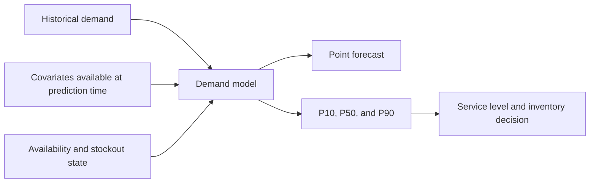
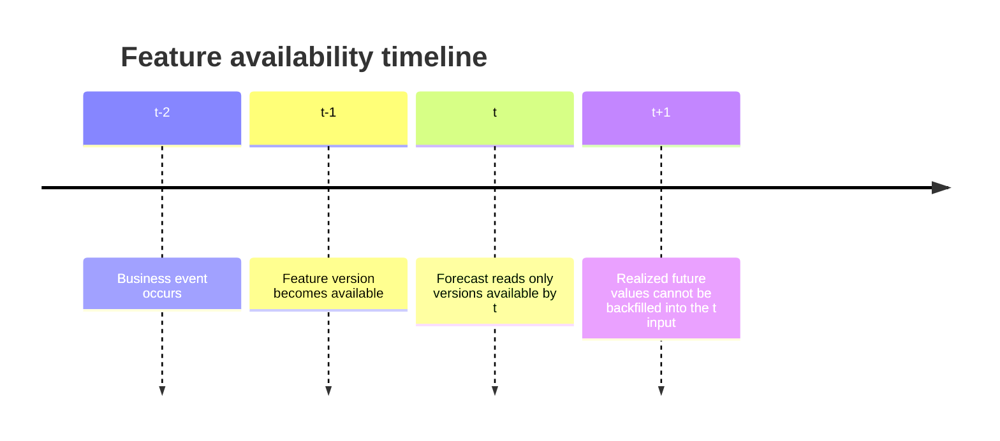
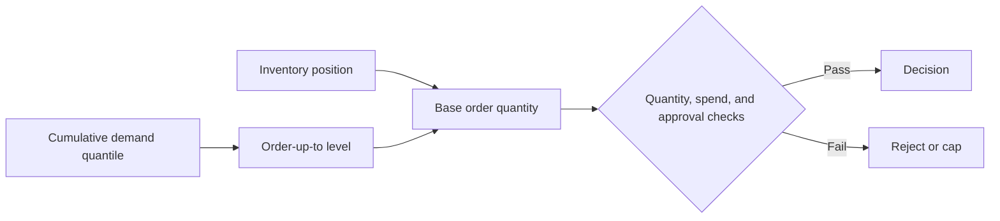

# Demand Covariates and Probabilistic Forecasting

This document explains demand covariates and probabilistic forecasting for instant retail. It focuses on data, statistical modeling, forecast output, and the connection to inventory decisions.



## 1. Problem Definition

For business unit `business_unit_id`, selling store `store_id`, fulfillment node `node_id`, SKU `sku_id`, and time `t`, define demand as:

```text
Y(store_id, node_id, sku_id, t)
```

The forecasting task estimates one or more future values from historical observations and information available at prediction time:

```text
Y(t+1), Y(t+2), ..., Y(t+h)
```

Three quantities must remain distinct:

- **Recorded sales**: completed quantities stored by the transaction system.
- **Observable demand**: sales observed while the item was available and visible.
- **Latent demand**: demand that might have occurred without stockouts, delisting, or exposure limits.

Recorded sales are often a lower bound on latent demand. Zero sales during a stockout should not be treated as a normal low-demand observation.

## 2. Demand Covariates

A demand covariate is a variable other than demand history that helps explain or predict demand variation:

```text
Y(t+h) = f(
    demand history,
    calendar,
    price and promotion,
    weather,
    store and trade area,
    availability and exposure,
    product lifecycle,
    other external information
)
```

### 2.1 Static Covariates

These change slowly:

- store location, format, and delivery radius;
- trade-area type, population, and aggregated points of interest;
- SKU category, pack size, shelf life, and brand;
- supplier, default lead time, and minimum order quantity.

They describe persistent differences among stores and SKUs.

### 2.2 Time-Varying Known Covariates

These vary with time but may be known before the forecasted period:

- weekday, hour, weekend, and holiday;
- planned promotion, price, or subsidy;
- weather forecast, temperature, and rain probability;
- planned opening hours and delivery coverage;
- product lifecycle stage.

Their source version and availability time must be retained.

### 2.3 Observed Covariates

These become known only when or after the event occurs:

- actual impressions and clicks;
- actual competitor prices;
- unplanned stockouts or delisting;
- actual fulfillment delay;
- revised observed weather.

Historical evaluation must not use their future realized values. Use the forecast, lagged observation, or scenario assumption that was available at the decision time.

## 3. Availability and Censored Demand

Demand data should retain sales and availability information together:

```text
sales
available
stockout_flag
available_minutes
exposure
```

During a stockout:

```text
observed_sales(t) = min(potential_demand(t), available_supply(t))
```

Common treatments include:

1. train only on available periods;
2. normalize by available duration;
3. restore demand from adjacent periods;
4. use substitutes, nearby stores, or exposure to estimate latent demand;
5. use the stockout state as a feature instead of treating censored sales as normal demand.

## 4. Time Consistency and Leakage

Each feature version should distinguish:

- `event_time`: when the business event occurs;
- `available_time`: when the value first becomes usable for a decision;
- `ingested_at`: when the current system receives it.

At prediction time `t`, a feature is usable only if:

```text
available_time <= t
```



Typical leakage includes using final observed weather instead of the forecast issued at the time, post-order refunds before ordering, realized promotion effects instead of the plan, full-period normalization during early evaluation, and random train-test splits for time series.

Use chronological train, validation, and test windows. Rolling backtests usually represent actual operation better than random cross-validation.

## 5. Point and Probabilistic Forecasts

### 5.1 Point Forecast

```text
forecast = E[Y(t+h) | information available at t]
```

A point forecast expresses one expected value but not tail risk or demand variability.

### 5.2 Probabilistic Forecast

```text
P(Y(t+h) | history, covariates available at t)
```

Output may be a full distribution, quantiles, a prediction interval, mean and variance, or a probability mass function for count demand.

For example:

```text
P10 = 5
P50 = 9
P90 = 16
```

Roughly 10 percent of outcomes are at or below 5, half are at or below 9, and 90 percent are at or below 16. Every quantile must state its forecast horizon and coverage definition.

### 5.3 Prediction and Confidence Intervals

A prediction interval describes uncertainty in a future realization. A confidence interval usually describes uncertainty in an estimated parameter or mean. Inventory decisions mainly need prediction intervals.

## 6. Common Modeling Methods

### 6.1 Statistical Baselines

- moving average;
- seasonal average;
- exponential smoothing;
- empirical historical quantiles.

The P90 of the last 28 comparable available days is a useful minimal probabilistic baseline.

### 6.2 Models with Covariates

Useful choices include linear and generalized linear models, LightGBM or XGBoost, quantile regression, and multi-quantile models.

For quantile `q` and residual `u = y - y_hat`, pinball loss is:

```text
L_q(u) = q * u,       u >= 0
         (q - 1) * u, u < 0
```

Training P50, P80, and P90 supports different service-level decisions.

### 6.3 Probabilistic Time-Series Models

Models such as DeepAR and TFT can learn across stores and SKUs while combining static features, history, and known future covariates. They require longer history, explicit availability markers, stable feature versioning, calibration evaluation, and enough related series for generalization.

A lower point error alone does not make a complex model better. Compare inventory, stockout, waste, and cash outcomes as well.

## 7. From Probability to Replenishment

Let lead time be `L`, review period be `R`, and inventory position be:

```text
inventory_position = on_hand + on_order - backorders
```

If the model provides quantile `q` of cumulative demand:

```text
reorder_point(q) = Quantile(sum(Y[t+1:t+L]), q)
order_up_to(q) = Quantile(sum(Y[t+1:t+L+R]), q)
order_qty = max(0, order_up_to(q) - inventory_position)
```



Minimum order quantity, spend, capacity, supplier, margin, and approval constraints still apply afterward.

### Numerical Example

Suppose cumulative two-day demand is P50 = 16 and P90 = 25. On-hand inventory is 10 and on-order inventory is 3, so inventory position is 13. A 90 percent service target gives an order quantity of 12. Using only the point estimate of 16 would suggest 3 units, reducing cash use but increasing stockout risk.

## 8. Forecast Quality

Point metrics include MAE, RMSE, WAPE, and MASE. They do not evaluate the probability distribution.

Probabilistic metrics include:

- **Pinball loss** for a selected quantile;
- **Coverage** for observed interval inclusion;
- **Calibration** for agreement between stated and realized quantile frequency;
- **Winkler score** for width and misses;
- **CRPS** for a full distribution.

If only 70 percent of actual demand is below a predicted P90, the forecast is not calibrated for a 90 percent service target.

Operational evaluation should also include stockout rate, fill rate, inventory days, committed cash, waste, expiry sell-through, contribution margin, and service-target deviation.

## 9. Input and Output Schema

Minimum input concepts include business unit, store, node, SKU, timestamp, demand, availability, stockout state, price, promotion, weather, holiday, and exposure.

Minimum output concepts include model name and version, input snapshot version, forecast scope, store or node, SKU, forecast range, point forecast, quantiles or distribution, and generation time.

`forecast_scope` must state whether the result describes a store or node. Store demand must be mapped and aggregated through store-to-node fulfillment relationships before it becomes node replenishment demand.

## 10. Common Errors

1. Treating recorded sales as uncensored true demand.
2. Using future actual weather, exposure, or competitor prices.
3. Replacing chronological evaluation with random splitting.
4. Checking MAE without quantile coverage.
5. Treating a mean forecast as safety stock.
6. Treating every wide interval as model failure without separating inherent demand variation from model error.
7. Ordering directly from store-level forecasts without node aggregation.
8. Applying one service level to every SKU, store, and cash situation.

## 11. Summary

- Covariates explain drivers; probabilistic forecasts express uncertainty.
- Every covariate must preserve time availability.
- Availability limits observed demand and must remain visible to modeling.
- Probability output should expose quantiles, intervals, or a distribution.
- Lead-time demand quantiles connect forecasting to replenishment.
- Evaluation must cover forecast quality and inventory outcomes.
- Store demand, node outbound demand, and network allocation are different scopes.

[Chinese version](demand_covariates_and_probabilistic_forecasting.zh-CN.md)
