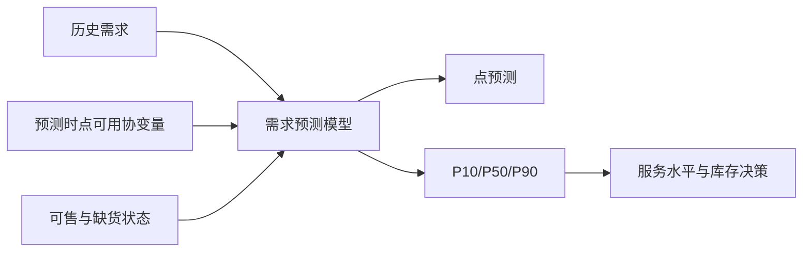
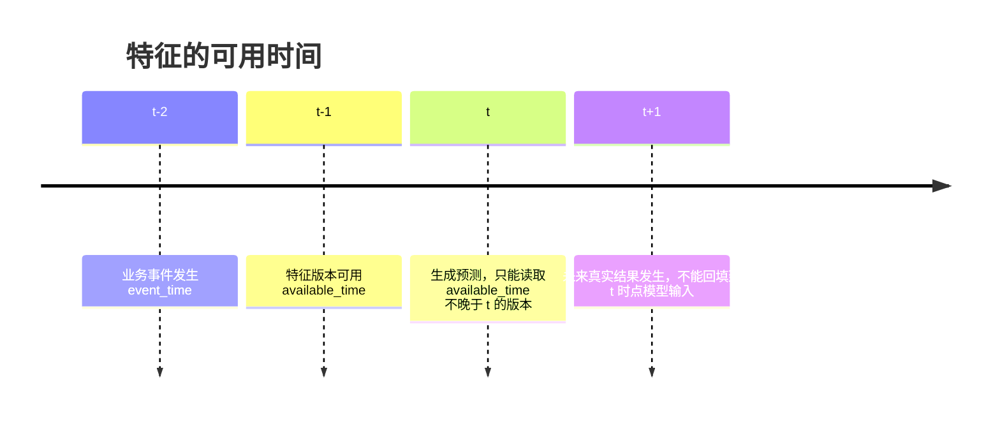
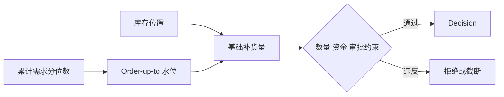

# 需求协变量与概率预测

本文介绍即时零售需求预测中的两个技术概念：需求协变量（demand covariates）和概率预测（probabilistic forecasting）。内容聚焦数据、统计建模、预测输出和库存决策衔接，不讨论项目计划、组织分工或商业平台建设。



## 1. 基本问题

对业务单元 `business_unit_id`、销售门店 `store_id`、履约仓点 `node_id`、商品 `sku_id` 和时间点 `t`，定义需求量：

```text
Y(store_id, node_id, sku_id, t)
```

需求预测的目标是根据历史观测和预测时刻可用的信息，估计未来一个或多个时间点的需求：

```text
Y(t+1), Y(t+2), ..., Y(t+h)
```

需要区分三个概念：

- **订单销量**：已经发生并被系统记录的成交数量；
- **可观测需求**：商品有库存、可售且被用户看到时产生的销量；
- **潜在需求**：如果没有缺货、下架或曝光限制，用户原本可能产生的需求。

即时零售中订单销量经常是潜在需求的下限。缺货期间的零销量不能直接作为低需求样本。

## 2. 需求协变量

需求协变量是除历史需求序列以外，能够解释或预测需求变化的变量。可以写成：

```text
Y(t+h) = f(
    历史需求,
    日历特征,
    价格和促销,
    天气,
    门店与商圈,
    可售与曝光状态,
    商品生命周期,
    其他外部信息
)
```

### 2.1 静态协变量

在较长时间内不变或变化很慢：

- 门店经纬度、门店类型、配送半径；
- 商圈类型、人口和 POI 聚合特征；
- SKU 品类、包装规格、保质期、品牌；
- 供应商、默认交货期和最小订货量。

静态协变量通常用于描述门店或 SKU 的长期差异。

### 2.2 时间变化协变量

随时间变化，但预测时可能已知或可提前获得：

- 星期、小时、周末、节假日；
- 计划促销、计划价格、平台补贴；
- 天气预报、温度、降雨概率；
- 门店营业时间和计划配送范围；
- 商品生命周期阶段。

这类变量可以直接进入未来预测，但必须保留其版本和可用时间。

### 2.3 观测型协变量

只有在当前或未来实际发生后才能知道：

- 实际曝光量和点击量；
- 实际竞争门店价格；
- 临时缺货或临时下架；
- 实际履约延迟；
- 事后修订的真实天气。

观测型协变量不能把未来真实值直接喂给历史预测，否则会产生数据泄漏。可以使用当时已经可见的预测值、滞后值或情景假设。

## 3. 可售性与缺货截断

需求数据至少需要同时保存销量和可售状态：

```text
sales
available
stockout_flag
available_minutes
exposure
```

当商品缺货时，观测到的销量满足：

```text
observed_sales(t) = min(potential_demand(t), available_supply(t))
```

因此，缺货日的销量是被库存截断后的结果。常见处理方法包括：

1. 排除缺货时段，只使用可售时段训练需求模型；
2. 使用可售时长作为暴露量修正；
3. 对缺货前后相邻时段进行需求恢复；
4. 使用替代商品、相邻门店或曝光数据估计潜在需求；
5. 将缺货状态作为模型特征，而不是把缺货销量当作正常销量。

## 4. 时间一致性与数据泄漏

每个特征至少应区分：

- `event_time`：业务事件实际发生时间；
- `available_time`：数据首次可供决策使用的时间；
- `ingested_at`：数据进入当前系统的时间。

在预测时刻 `t`，只能使用满足以下条件的特征版本：

```text
available_time <= t
```



典型泄漏包括：

- 用事后最终天气替代当时发布的天气预报；
- 用订单完成后的退款结果预测下单前需求；
- 用未来促销实际效果替代当时已知的促销计划；
- 用全周期数据计算归一化参数，再评估早期时间段；
- 随机切分时间序列，使训练集包含测试期之后的数据。

时间序列通常应采用按时间顺序的训练、验证和测试切分，滚动回测比随机交叉验证更符合真实使用方式。

## 5. 点预测与概率预测

### 5.1 点预测

点预测只输出一个数：

```text
forecast = E[Y(t+h) | information available at t]
```

它适合展示单一预期值，但无法直接表达需求波动和尾部风险。

### 5.2 概率预测

概率预测估计未来需求的条件分布：

```text
P(Y(t+h) | history, covariates available at t)
```

常见输出形式：

- 完整概率分布；
- 多个分位数；
- 预测区间；
- 均值和方差；
- 离散需求的概率质量函数。

例如：

```text
P10 = 5
P50 = 9
P90 = 16
```

含义是：约 10% 的结果不超过 5，约一半的结果不超过 9，约 90% 的结果不超过 16。分位数必须说明预测时间范围和覆盖定义。

### 5.3 预测区间与置信区间

预测区间描述未来真实需求的不确定性；置信区间通常描述参数或均值估计的不确定性。库存决策主要需要预测区间，而不是只描述平均需求估计误差的置信区间。

## 6. 常见建模方法

### 6.1 统计基线

- 移动平均；
- 季节平均；
- 指数平滑；
- 历史需求经验分位数。

经验分位数是最简单的概率预测基线。例如使用过去 28 个可售日需求的 P90 估计未来相似条件下的高需求水平。

### 6.2 带协变量的机器学习模型

可使用：

- 线性回归和广义线性模型；
- LightGBM、XGBoost 等树模型；
- 分位数回归；
- 直接预测多个分位数的模型。

分位数回归常用 pinball loss。对目标分位数 `q` 和误差 `u = y - y_hat`：

```text
L_q(u) = q * u,       u >= 0
         (q - 1) * u, u < 0
```

分别训练 P50、P80、P90，可以得到面向不同服务水平的需求估计。

### 6.3 概率时序模型

DeepAR、TFT 等模型可以直接学习跨门店、跨 SKU 的条件分布，并融合静态特征、历史序列和已知未来协变量。它们通常需要：

- 更长且更完整的历史数据；
- 明确的缺货和可售标记；
- 稳定的特征版本管理；
- 分布质量和校准评估；
- 足够的样本量支持跨序列泛化。

复杂模型不能因为点预测误差较低就自动判定更好，必须同时比较库存、缺货、损耗和现金占用结果。

## 7. 概率输出与补货计算

设交货期为 `L` 天，复核周期为 `R` 天，库存位置为：

```text
inventory_position = on_hand + on_order - backorders
```

如果模型能够得到未来 `L` 天累计需求的 `q` 分位数，则订货点可以定义为：

```text
reorder_point(q) = Quantile(sum(Y[t+1:t+L]), q)
```

最高水位可以使用交货期加复核周期的需求分位数：

```text
order_up_to(q) = Quantile(sum(Y[t+1:t+L+R]), q)
```

基础补货量为：

```text
order_qty = max(0, order_up_to(q) - inventory_position)
```

随后仍需执行最小订货量、最大采购金额、库容、供应商能力、毛利和审批阈值等约束。



### 数值示例

假设未来两天累计需求的预测分位数为：

```text
P50 = 16
P90 = 25
```

当前库存为 10，在途库存为 3：

```text
inventory_position = 10 + 3 = 13
```

若目标服务水平为 90%：

```text
reorder_point = 25
order_qty = 25 - 13 = 12
```

如果使用点预测 16，则只会建议补货 3 件，资金占用较低，但缺货风险更高。

## 8. 概率预测质量评估

### 8.1 点预测指标

- MAE；
- RMSE；
- WAPE；
- MASE。

点预测指标不能单独评价概率预测。

### 8.2 概率预测指标

- **Pinball Loss**：评价特定分位数预测；
- **Coverage**：实际值落入预测区间的比例；
- **Calibration**：预测的 P90 是否约有 90% 的实际值不超过它；
- **Winkler Score**：同时考虑区间宽度和区间外惩罚；
- **CRPS**：评价完整预测分布与实际观测之间的距离。

如果 P90 预测只有 70% 的实际需求不超过它，说明预测区间没有校准，不能直接用于 90% 服务水平补货。

### 8.3 经营指标

还应评估：

- 缺货率和订单满足率；
- 库存周转天数；
- 库存资金占用；
- 损耗率和临期售罄率；
- 贡献毛利；
- 预测服务水平与目标服务水平的偏差。

## 9. 数据与输出 Schema

需求预测输入至少需要表达：

```text
business_unit_id
store_id
node_id
sku_id
timestamp
demand
available
stockout_flag
price
promotion
weather
holiday
exposure
```

预测输出至少需要表达：

```text
model_name
model_version
input_snapshot_version
forecast_scope
store_id / node_id
sku_id
forecast_start
forecast_end
point_forecast
quantiles or distribution
generated_at
```

`forecast_scope` 必须明确是 `store` 还是 `node`。门店需求预测需要先经过门店到仓点的履约映射和汇总，才能用于仓点补货。

## 10. 常见错误

1. 把订单销量当作未受库存限制的真实需求。
2. 用未来实际天气、未来曝光或未来竞争价格造成泄漏。
3. 用随机切分代替时间切分。
4. 只看 MAE，不检查预测区间覆盖率。
5. 把均值预测直接当作安全库存。
6. 把预测区间宽度误认为模型一定不可靠，而没有区分真实需求波动和模型误差。
7. 在门店层预测后直接按门店结果给仓点下单，忽略多个门店共用仓点的汇总关系。
8. 用同一个服务水平覆盖所有 SKU、门店和现金约束场景。

## 11. 技术要点总结

- 协变量描述需求变化的外部原因，概率预测描述未来需求的不确定性。
- 协变量必须带时间可用性，不能使用决策时未知的信息。
- 缺货和下架会造成需求截断，必须保留可售状态和曝光信息。
- 概率预测应输出分位数、区间或分布，而不只是一个点。
- 补货可以通过交货期需求分位数和目标服务水平连接到预测结果。
- 评估必须同时包含预测质量和库存经营结果。
- 门店需求、仓点出库需求和跨仓分配是不同预测范围，不能混用。

[English version](demand_covariates_and_probabilistic_forecasting.md)
