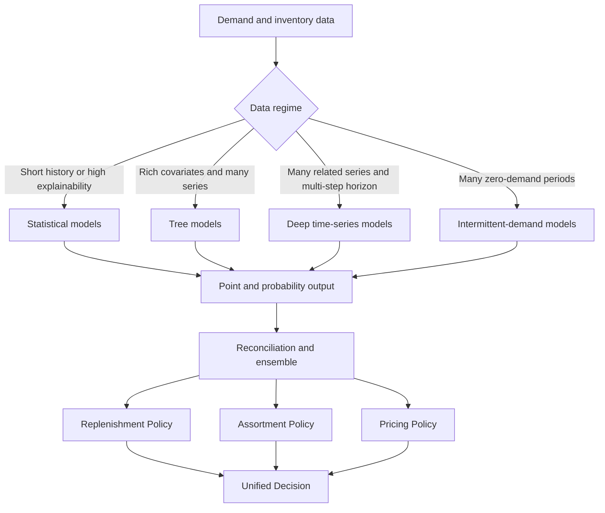
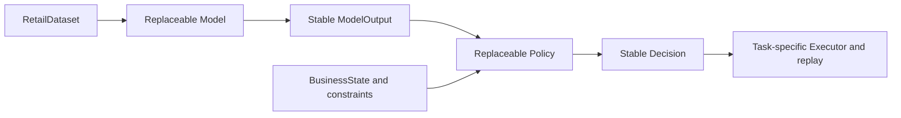

# Model and Decision Algorithm Selection Guide for Instant Retail

Updated September 10, 2026. This guide covers methods that may belong in the Model Zoo and Policy Zoo. It explains how they work, suitable data regimes, tradeoffs, and interface requirements. No method should be used for production decisions without validation on customer data.

## 1. Selection Goals

The guide helps answer four questions:

1. Should a SKU use a statistical, tree-based, intermittent-demand, or deep time-series model?
2. When is a point forecast, quantile forecast, or full probability distribution appropriate?
3. How should forecasting remain separate from replenishment, assortment, and pricing?
4. Why can the lowest offline error still produce worse inventory outcomes?

```text
history + time-available covariates -> point forecast / quantiles / distribution
model output + business state + constraints -> decision
```

A Model must not write to purchasing, pricing, or assortment systems. A Policy must not bypass Executor validation.

## 2. Technical Map



Always retain simple baselines. Complexity has value only when rolling backtests and operational replay show stable improvement.

## 3. Demand Forecasting Models

### 3.1 Baselines and Statistical Models

| Model | Suitable case | Advantages | Limitations | Recommended role |
|---|---|---|---|---|
| Naive or Seasonal Naive | Short history or clear weekly seasonality | Nearly free, transparent, essential comparison | Ignores trend and covariates | Mandatory evaluation baseline |
| Moving average | Stable, frequent demand | Robust and easy to explain | Lags trend and has no uncertainty model | Current transparent baseline |
| Holt, Holt-Winters, or AutoETS | Level, trend, or stable seasonality | Works with short series and can produce intervals | Limited nonlinear promotion effects | Strong low-cost candidate |
| AutoARIMA or SARIMAX | Strong autocorrelation and stable cycles | Diagnosable structure and intervals | Sensitive to outliers, censoring, and structural change | Priority SKUs and statistical control group |
| Theta | Clear trend and modest seasonal complexity | Often robust with few parameters | Limited covariate support | Ensemble member |

StatsForecast offers a common interface for several of these models and is a practical way to build a statistical model group.

### 3.2 Intermittent-Demand Models

Long-tail SKUs often contain many zero-demand periods. Ordinary regression may produce persistent tiny orders.

| Model | Basic approach | Advantages | Limitations | Suitable case |
|---|---|---|---|---|
| Croston | Separately estimates nonzero size and interval | Simple and designed for sparse demand | Original form is biased and slow to detect disappearance | Intermittent but continuing items |
| Croston-SBA | Bias-corrected Croston | Usually more stable | Assumes a stable occurrence process | Long-tail regular items |
| TSB | Smooths occurrence probability and nonzero size | Detects gradual obsolescence faster | Parameter-sensitive and weak on sudden spikes | End-of-life or low-frequency items |
| ADIDA or IMAPA | Aggregates time before forecasting | Reduces zeros and noise | Loses exact timing and can oversmooth | Sparse daily but stable weekly demand |

Use a routing rule based on sparsity rather than forcing one model to cover both fast movers and extremely sparse items.

### 3.3 Gradient-Boosted Trees

Tree models combine calendar, promotion, weather, price, store, product, lag, and rolling features in a global model.

| Model | Advantages | Limitations | Best fit |
|---|---|---|---|
| LightGBM | Fast training and inference; regression and quantile objectives | Small data and high-cardinality IDs can overfit | Many SKUs, rich covariates, fast iteration |
| XGBoost | Mature tooling, regularization, constraints, distributed training, and analysis | Can use more memory and time | Robust engineering ecosystem and constrained models |
| CatBoost | Native high-cardinality category handling; quantile losses | Training and model size can be larger | Many store, brand, and category variables |
| Random Forest or Extra Trees | Simple tuning and robust nonlinear control model | Large model size, weak extrapolation | Small or medium data comparison |

Never use random train-test splits for time-series features. Lag, rolling, target encoding, normalization, and category statistics must use only information available at prediction time.

### 3.4 Deep Time-Series Models

| Model | Advantages | Limitations | Use only when |
|---|---|---|---|
| DeepAR | Shares parameters across series and models probability distributions | Recursive errors and tuning complexity | Hundreds or more related series exist |
| TFT | Static, historical, and known-future covariates with multi-step output | High cost; attention is not causal explanation | Rich covariates and multiple horizons justify it |
| N-BEATS or N-BEATSx | Direct multi-step output and useful decomposition | Needs more data; original form has weak exogenous support | A strong multi-step candidate is needed |
| N-HiTS | Efficient multi-resolution long-horizon forecasting | Often no advantage on short, small data | Many series and longer horizons exist |
| PatchTST | Captures long dependencies with patch-based attention | Sparse counts, censoring, and categories need special handling | Long histories and sufficient compute exist |
| Graph plus time-series model | Can use product or fulfillment relationships | A wrong graph propagates bias and is hard to explain | A trusted graph already exists |

Deep models require shared training, validation, and tuning infrastructure. They should not replace statistical and tree baselines when data is limited.

## 4. Probabilistic Forecasting and Calibration

| Method | Advantages | Limitations | Recommended use |
|---|---|---|---|
| Direct quantile regression | Optimizes business quantiles directly | Quantiles can cross; separate models may be required | Service-level replenishment |
| Multi-quantile loss | Produces several quantiles in one model | More complex and still needs calibration | Deep models or CatBoost output |
| Parametric distribution | Provides count or continuous distribution parameters | Wrong distribution can underestimate tails | Count demand or simulation |
| Conformal prediction | Calibrates intervals under weaker assumptions | Needs a calibration window; drift breaks coverage | Add intervals to a point model |
| Bootstrap or residual simulation | Produces replay scenarios | Residual assumptions may fail under heteroscedasticity | Inventory simulation |

Evaluate pinball loss, coverage, interval width, and calibration error. MAE alone cannot show whether P90 supports a 90 percent service target.

## 5. Hierarchical Forecasting and Ensembles

Business unit, region, store, node, category, and SKU form grouped structures. Independent forecasts may violate:

```text
business unit forecast = sum of store forecasts
node demand = fulfillment aggregation of served-store demand
```

| Method | Advantages | Limitations |
|---|---|---|
| Bottom-up | Simple and coherent when bottom-level data is reliable | Bottom-level noise accumulates |
| Top-down | Stable high-level forecast and low compute | Allocation ratios hide local change and new items |
| MinTrace or MinT Shrink | Balances levels using error covariance | Needs reliable residuals and matrix computation |
| Nonnegative reconciliation | Prevents negative demand | Requires additional optimization |

Ensembles may use a simple average, validation weights, or SKU routing. They reduce single-model risk but can hide leakage or lower interpretability.

## 6. Replenishment and Inventory Algorithms

| Algorithm | Advantages | Limitations | Suitable scope |
|---|---|---|---|
| Safety stock plus order-up-to | Transparent and easy to combine with lead and review periods | Relies on distribution and service assumptions | Single-node baseline |
| Newsvendor or quantile replenishment | Converts underage and overage cost into a critical quantile | Strong single-period assumption | Short-life or event items |
| Reorder point and order-up-to | Avoids repeated small orders | Thresholds need SKU calibration | Fixed ordering cost or minimum quantity |
| Base-stock | Restores inventory position each review | Can use too much cash under volatility | Frequent stable replenishment |
| Dynamic programming | Expresses multi-period state and waste | State space grows rapidly | Few SKUs and controlled dimensions |
| Robust optimization | Protects against uncertainty | Can be overly conservative | High stockout cost or unstable supply |
| Multi-echelon optimization | Coordinates central, node, and store inventory | High data and solver complexity | Clear multi-level ownership and transfer rules |

Probability output should feed a Policy. The forecasting Model should not calculate or execute purchase actions.

## 7. Assortment, Allocation, and Transfer

| Algorithm | Advantages | Limitations | When to use |
|---|---|---|---|
| Risk-adjusted score | Transparent ranking using margin, turnover, stockout, and waste | Weights are subjective | Human review queue |
| MNL or Nested Logit | Models substitution and customer choice | Needs exposure, choice sets, and no-purchase data | Assortment and substitution analysis |
| Knapsack | Selects value under shelf, cash, or SKU-count limits | Simplifies substitution and time dynamics | Static assortment baseline |
| MIP or CP-SAT | Expresses integer, Boolean, budget, capacity, and bundle constraints | Modeling and solve time can be difficult | Constrained assortment and allocation |
| Minimum-cost flow | Efficient and auditable network allocation | Weak for nonlinear and bundle rules | Supply allocation and routing |

Use LP or MIP for mostly continuous linear constraints, CP-SAT for Boolean logic, and minimum-cost flow for a pure network structure.

## 8. Pricing and Promotion

| Algorithm | Advantages | Limitations | Prerequisite |
|---|---|---|---|
| Rule-based expiry markdown | Explainable with price floors and discount caps | Does not estimate elasticity | Safe demonstration baseline |
| Elasticity regression | Quantifies price-demand association | Selection bias and confounding can create false effects | Stable price variation and controls |
| Double ML or causal forest | Estimates heterogeneous treatment effects | Requires identification and overlap assumptions | Experiments or rich pre-treatment data |
| Contextual bandit | Learns exploration and exploitation online | Exploration has real cost and needs controls | Approval, rollout, rollback, and feedback |
| Reinforcement learning | Represents long-term reward and state | Hard evaluation and safety risk | High-quality simulator and strict offline evaluation |
| Pricing MIP | Controls price tiers, margin, inventory, and campaign rules | Requires a reliable demand curve | Discrete prices and clear constraints |

A model trained on historical promotions estimates conditional association, not causal lift. Incrementality requires experiments, quasi-experiments, or explicit causal assumptions.

## 9. Recommended Combinations

### 9.1 General Daily Demand

```text
Seasonal Naive
AutoETS or AutoARIMA
LightGBM Quantile
validation-weighted ensemble
```

### 9.2 Long-Tail Demand

```text
TSB, Croston-SBA, or ADIDA
zero-occurrence classifier plus positive-demand regression
routing by SKU sparsity
```

### 9.3 Many Stores and SKUs

```text
LightGBM or CatBoost global model
DeepAR or N-HiTS as an advanced candidate
Bottom-up or MinTrace reconciliation
```

### 9.4 Assortment, Expiry, and Pricing

```text
probabilistic demand forecast
risk-adjusted score
MIP or CP-SAT constraints
causal elasticity or experiment estimate
human approval and Executor validation
```

The Policy objective should combine stockout, waste, margin, cash, and service level rather than maximize predicted sales alone.

## 10. Model Zoo and Policy Zoo Interfaces

A Model asset should declare its task, scope, input schema, feature availability, horizon, output type, supported data regime, training cost, and limitations. A Policy asset should declare its decision type, required model output and business state, objective, hard constraints, approval rules, executor compatibility, replay assumptions, and limitations.



Model replacement must preserve `RetailDataset -> ModelOutput`. Policy replacement must preserve `DecisionConstraints`, Executor, and Recorder. Replenishment, assortment, pricing, and store risk remain different tasks.

## 11. Selection Matrix

| Data or problem characteristic | First choice | Second choice | Defer |
|---|---|---|---|
| Less than one seasonal cycle | Seasonal Naive, moving average, Holt | Global tree model | TFT, PatchTST |
| Clear weekly seasonality and few covariates | AutoETS, AutoARIMA | N-BEATS | High-complexity Transformer |
| Rich promotion, weather, and price features | LightGBM, CatBoost | XGBoost, N-BEATSx | Pure univariate model |
| Very high zero-demand ratio | TSB, Croston-SBA, ADIDA | Two-stage model | Ordinary squared-error regression |
| Many related series | Global LightGBM, DeepAR | N-HiTS, TFT | Individually tuned ARIMA per SKU |
| Service-level replenishment | Quantile regression, conformal interval | Parametric distribution | Mean only |
| Coherent store and node forecasts | Bottom-up, MinTrace | Top-down | Independent levels |
| Complex budget and assortment constraints | MIP, CP-SAT | Heuristic | Direct model action |
| Promotion incrementality | Randomized experiment, Double ML, causal forest | Quasi-experiment | Correlation-only prediction |

## 12. Common Mistakes

1. Substituting model complexity for outcome validation.
2. Evaluating time series with random splits.
3. Building historical features from future actual values.
4. Treating stockout sales as uncensored demand.
5. Using one model and service level for every SKU.
6. Comparing MAE without calibration, stockout, waste, and cash metrics.
7. Interpreting feature importance as causal effect.
8. Running online learning without approval and rollback.
9. Forecasting stores and nodes without fulfillment mapping.
10. Adding deep models without enough data and backtest evidence.

## 13. References

- [LightGBM documentation](https://lightgbm.readthedocs.io/en/stable/)
- [XGBoost categorical features](https://xgboost.readthedocs.io/en/stable/tutorials/categorical.html)
- [CatBoost categorical features](https://catboost.ai/docs/en/features/categorical-features)
- [CatBoost quantile losses](https://catboost.ai/docs/en/concepts/loss-functions-regression)
- [StatsForecast models](https://nixtlaverse.nixtla.io/statsforecast/src/core/models.html)
- [NeuralForecast model list](https://nixtlaverse.nixtla.io/neuralforecast/docs/capabilities/overview.html)
- [Amazon SageMaker DeepAR](https://docs.aws.amazon.com/sagemaker/latest/dg/deepar.html)
- [Temporal Fusion Transformer paper](https://doi.org/10.48550/arXiv.1912.09363)
- [N-BEATS implementation and paper](https://github.com/ServiceNow/N-BEATS)

[Chinese version](model_and_algorithm_selection_guide.zh-CN.md)
