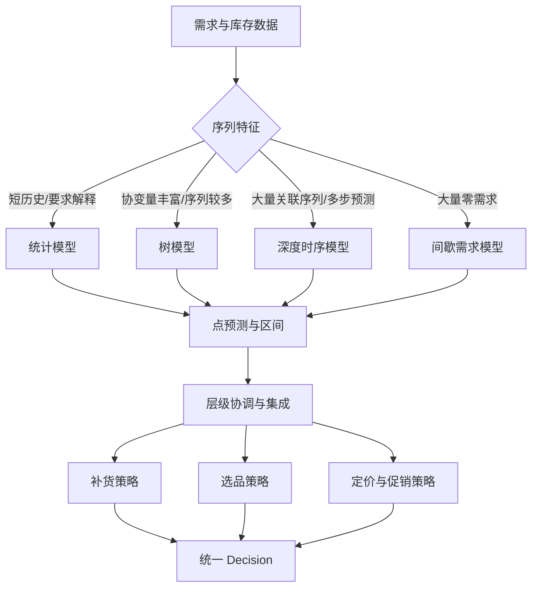
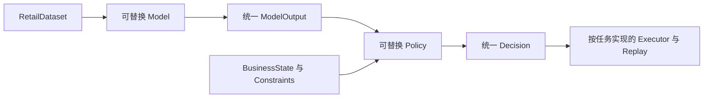

# 即时零售模型与决策算法选型指南

本文档更新于 2026 年 9 月 10 日，讨论即时零售中值得纳入 Model Zoo（模型资产库）和 Policy Zoo（策略资产库）的模型与算法。内容只描述技术原理、适用条件、优缺点和接口要求，不表示任何模型可以未经数据验证直接用于生产决策。

## 1. 选型目标

完成阅读后，应能够回答：

1. 某类 SKU 应使用统计模型、树模型还是深度时序模型。
2. 点预测、分位数预测和完整概率分布分别适合什么决策。
3. 预测模型与补货、选品、定价算法之间如何分工。
4. 为什么离线误差最低的模型不一定产生最好的库存经营结果。

模型负责估计未来状态：

```text
历史需求 + 可用协变量 -> 点预测 / 分位数 / 概率分布
```

策略负责根据预测、库存和约束生成动作：

```text
模型输出 + BusinessState + DecisionConstraints -> Decision
```

不能让 Model 直接写入采购、调价或下架系统，也不能让 Policy 绕过 Executor 的二次约束校验。

## 2. 总体技术地图



核心路径应始终保留简单基线。复杂模型只有在滚动回测和经营回放中稳定优于基线时才有技术价值。

## 3. 需求预测模型

### 3.1 基线与统计模型

| 模型 | 适用场景 | 优点 | 缺点 | 推荐定位 |
|---|---|---|---|---|
| Naive / Seasonal Naive | 历史较短、日周季节明显 | 极易解释、训练成本接近零、适合作为最低基线 | 不使用趋势和协变量，遇到结构变化表现弱 | 必须保留的评估基线 |
| 移动平均 | 平稳、高频、波动不大的 SKU | 简单稳健，对局部噪声不敏感 | 滞后于趋势，不能表达季节性和不确定性 | 当前框架的透明基线 |
| Holt / Holt-Winters / AutoETS | 有水平、趋势或稳定季节性 | 参数少、可解释、短序列也能工作，可产生预测区间 | 难以表达复杂促销和非线性交互；逐序列建模时维护量较大 | 建议增加 `AutoETS` 或 Holt-Winters |
| AutoARIMA / SARIMAX | 自相关强、有稳定周期或少量外生变量 | 统计结构清晰，可做诊断和区间预测 | 参数搜索较慢，对异常值、断货截断和频繁结构变化敏感 | 适合重点 SKU 和统计对照组 |
| Theta | 趋势明显但季节结构不复杂 | 在许多单变量任务上稳健，参数较少 | 难以使用协变量，也难描述复杂非线性 | 可作为低成本统计集成成员 |

StatsForecast 通过同一套接口提供 AutoARIMA、AutoETS、Theta、Holt-Winters 和多种基线，并支持预测区间，适合组成统计模型组。

### 3.2 间歇需求模型

即时零售长尾 SKU 经常出现大量零需求。此时普通回归模型容易持续输出很小的正数，既不准确，也会造成碎片化补货。

| 模型 | 基本做法 | 优点 | 缺点 | 适用条件 |
|---|---|---|---|---|
| Croston | 分别估计非零需求量和需求间隔 | 实现简单，适合零值很多的序列 | 原始形式存在偏差，不能快速响应需求消失 | 有间歇需求但仍持续销售的 SKU |
| Croston-SBA | 对 Croston 结果做偏差修正 | 通常比原始 Croston 更稳健 | 仍假设需求出现规律相对稳定 | 长尾常规商品 |
| TSB | 分别平滑需求概率和非零需求量 | 能较快识别需求逐渐消失或商品退市 | 参数敏感，对突然爆发需求反应有限 | 生命周期末期、低频销售 SKU |
| ADIDA / IMAPA | 先聚合时间尺度，再预测并拆分 | 能减少零值和高频噪声 | 聚合会损失精确时间位置，拆分结果可能过平滑 | 日需求过稀疏但周需求较稳定 |

推荐将间歇需求识别作为路由逻辑，而不是要求一个全局模型同时覆盖畅销品和极稀疏长尾品。

### 3.3 梯度提升树模型

树模型适合将日历、促销、天气、价格、门店、商品属性、lag 和 rolling 特征放入一个全局模型。

| 模型 | 优点 | 缺点 | 更适合的情况 |
|---|---|---|---|
| LightGBM | 训练和推理效率高，适合大量数值特征与大规模样本；支持回归和 quantile objective | 对小数据和高基数 ID 容易过拟合；需要自行构造时间特征和防止泄漏 | SKU 较多、协变量丰富、需要快速迭代；当前框架已提供实现 |
| XGBoost | 工具链成熟，正则化、约束、分布式训练和模型分析工具完整；支持类别特征接口 | 训练速度和内存可能不如 LightGBM；类别编码和模型序列化需遵守其格式要求 | 更重视稳健性、约束设置和成熟工程生态 |
| CatBoost | 原生处理类别特征，适合门店、品牌、品类等高基数变量；支持 Quantile 与 MultiQuantile loss | 训练时间可能更长，模型体积和推理成本需评估 | 类别变量多、手工编码成本高、冷启动依赖商品属性 |
| Random Forest / Extra Trees | 调参相对简单，对异常和非线性较稳健 | 模型体积大，外推能力弱，概率分位数需要额外方法 | 中小数据集的稳健对照模型 |

树模型常见错误是随机拆分训练集和测试集。所有 lag、rolling、目标编码、归一化和类别统计都必须只使用预测时刻已经可用的数据。

### 3.4 深度时序模型

| 模型 | 优点 | 缺点 | 建议使用条件 |
|---|---|---|---|
| DeepAR | 跨大量相关序列共享参数；天然面向概率预测和冷启动 | 递归预测可能累积误差；训练、调参和分布选择更复杂 | 至少数百条相关序列，且需要概率分布 |
| TFT | 支持静态、历史和已知未来协变量；适合多步预测，并提供变量选择和注意力解释 | 参数量和训练成本高；解释结果不等同于因果效应 | 多时间尺度、协变量丰富、预测区间较长 |
| N-BEATS / N-BEATSx | 多步直接预测，结构清晰；N-BEATS 可分解趋势和季节成分，N-BEATSx 可加入协变量 | 原始 N-BEATS 不擅长外生变量；需要较多训练样本 | 希望获得强多步基线或可解释分解 |
| N-HiTS | 多分辨率插值，长预测区间通常更高效 | 对短历史和小数据可能没有优势 | 多步、长区间预测且序列数量较多 |
| PatchTST | 使用时间片段降低长序列注意力成本，适合捕捉长依赖 | 对即时零售稀疏计数、断货截断和类别特征仍需专门处理 | 历史窗口长、周期复杂、算力充足 |
| GNN + 时序模型 | 能利用替代品、关联品、门店网络或仓点网络关系 | 图构建错误会传播偏差；训练和解释复杂 | 已有可信商品图或履约网络图，不应仅因“高级”而使用 |

DeepAR 更适合大量相关序列；TFT、N-BEATS、N-HiTS、PatchTST 等模型需要共用的训练、验证和超参数搜索工具。它们不应在数据量不足时取代统计和树模型基线。

## 4. 概率预测与校准算法

| 方法 | 优点 | 缺点 | 推荐用途 |
|---|---|---|---|
| 直接 Quantile Regression | 直接优化 P50/P80/P90 等业务分位数 | 分位数可能交叉；每个分位数可能需要独立训练 | 与服务水平补货直接衔接 |
| Multi-Quantile Loss | 一个模型同时输出多个分位数 | 模型和损失实现更复杂，仍需校准 | 深度模型或 CatBoost 多分位数输出 |
| 参数分布 | 输出 Poisson、Negative Binomial、Gaussian 等分布参数 | 分布假设错误会系统性低估尾部风险 | 计数需求或完整概率模拟 |
| Conformal Prediction | 可在较弱分布假设下校准预测区间 | 需要独立校准窗口；时间漂移会破坏覆盖率 | 给现有点预测模型增加区间 |
| Bootstrap / Residual Simulation | 易于给统计或树模型生成情景样本 | 假设残差结构可复用，处理异方差较困难 | 回放和库存蒙特卡洛模拟 |

概率模型至少应评估 `pinball loss`、区间覆盖率、区间宽度和校准误差。只比较 MAE 无法判断 P90 是否适合 90% 服务水平。

## 5. 层级预测与集成

总店、区域、门店、仓点、品类和 SKU 会形成层级或分组结构。各层独立预测后通常不满足：

```text
总店预测 = 所有门店预测之和
仓点需求 = 其服务门店需求的履约汇总
```

推荐算法：

| 算法 | 优点 | 缺点 |
|---|---|---|
| Bottom-Up | 简单、天然一致，适合底层数据可靠时 | 底层噪声会向上累积 |
| Top-Down | 高层预测稳定，计算成本低 | 分摊比例可能掩盖局部变化和新品 |
| MinTrace / MinT Shrink | 利用误差协方差协调各层预测，通常比简单聚合更平衡 | 需要可靠残差；大层级的协方差和矩阵计算成本高 |
| 非负协调 | 避免销量或需求出现负预测 | 通常需要额外优化，速度更慢 |

模型集成可以使用简单平均、验证集加权或按 SKU 类型路由。优点是降低单模型失效风险；缺点是可解释性下降，并可能掩盖某个模型的系统性泄漏。

## 6. 补货与库存算法

| 算法 | 优点 | 缺点 | 适用范围 |
|---|---|---|---|
| Safety Stock + Order-up-to | 逻辑透明，容易加入交货期和复核周期 | 依赖均值、方差和服务水平假设 | 常规单仓点补货基线 |
| Newsvendor / 分位数补货 | 通过缺货成本和积压成本确定临界分位数 | 单周期假设较强，成本参数难准确获得 | 短保、单周期或活动商品 |
| `(s, S)` 策略 | 低于订货点才补到目标库存，可降低频繁小单 | `s`、`S` 需要按 SKU 校准 | 有固定订货成本或最小订货量 |
| Base-stock | 每期恢复到目标库存位置，适合连续复核 | 需求和交货期变化大时资金占用高 | 高频稳定补货 |
| 动态规划 | 可表达多周期库存、损耗和状态转移 | 状态空间迅速爆炸 | SKU 数量有限、状态维度可控 |
| 鲁棒优化 | 对预测误差和参数不确定性更保守 | 容易过度保守，区间设置困难 | 高缺货损失或供应不稳定 |
| 多级库存优化 | 同时协调总仓、仓点和门店库存 | 数据、网络和求解复杂度高 | 多层库存所有权和调拨关系明确后 |

建议让概率预测输出进入 Newsvendor、`(s, S)` 或 Base-stock Policy，而不是让预测模型直接计算采购动作。

## 7. 选品、分配与调拨算法

| 算法 | 优点 | 缺点 | 适合使用的情况 |
|---|---|---|---|
| 风险调整评分 | 透明、易解释，可融合毛利、周转、缺货和损耗 | 权重带有主观性，不能保证全局最优 | 适合作为人工评审排序 |
| MNL / Nested Logit | 能描述商品间替代和消费者选择 | 需要曝光、选择集和未购买数据；独立无关替代假设可能不成立 | 适合选品和缺货替代分析 |
| Knapsack | 在货架、资金或 SKU 数约束下选择最大价值组合 | 简化了替代、组合和时间动态 | 单门店静态选品基线 |
| MIP / CP-SAT | 能显式表达整数数量、布尔选品、预算、容量、供应商和组合约束 | 建模复杂，规模扩大后求解时间可能不稳定 | 适合约束明确的选品、分配和调拨 |
| Min-cost Flow | 对仓点到门店的网络分配高效、结果易审计 | 难表达复杂非线性和组合规则 | 供给分配、跨仓调拨和履约路由 |

当问题主要由连续变量和线性约束构成时可优先考虑 LP/MIP；当大多数决策是布尔选择和逻辑约束时，CP-SAT 通常更自然；纯网络结构可优先考虑最小费用流。

## 8. 定价与促销算法

| 算法 | 优点 | 缺点 | 适用前提 |
|---|---|---|---|
| 规则型临期折扣 | 可解释、可设置成本价底线和最大折扣 | 不估计价格弹性，可能折扣不足或过度 | 当前框架的安全演示基线 |
| 价格弹性回归 | 能量化价格变化与需求变化关系 | 促销选择偏差、竞争和季节混杂会导致伪相关 | 有稳定价格变化和充分控制变量 |
| Double ML / Causal Forest | 估计异质促销或折扣处理效应，能使用灵活 ML 控制高维混杂 | 依赖无遗漏混杂、重叠性等识别假设；实现和验证复杂 | 有实验数据或丰富的处理前协变量 |
| Contextual Bandit | 能在探索与利用之间动态学习不同商品/门店的动作收益 | 探索会产生真实经营成本，需要安全约束和在线反馈 | 有审批、灰度、回退和可靠回执之后 |
| 强化学习 | 能处理长期回报、库存状态和连续动作 | 反事实评估困难，奖励设计和安全性风险高 | 只适合高质量仿真器和严格离线评估环境 |
| 价格优化 MIP | 能同时控制价格档位、毛利、库存和活动规则 | 需求曲线必须先可靠估计，整数规模可能很大 | 离散价格档位和约束清晰的批量优化 |

预测相关性不能直接解释为促销因果效果。使用历史促销数据训练普通 LightGBM，只能得到条件预测；要回答“不促销时会怎样”，需要随机实验、准实验或明确的因果识别假设。

## 9. 推荐组合

### 9.1 通用日级需求

```text
Seasonal Naive
AutoETS / AutoARIMA
LightGBM Quantile
验证集加权集成
```

优点是统计模型提供稳定基线，LightGBM 融合促销、天气和商品属性，分位数可以直接进入补货策略。

### 9.2 长尾与间歇需求

```text
TSB / Croston-SBA / ADIDA
零需求概率分类 + 非零需求量回归
按 SKU 稀疏度路由
```

不建议直接用一个普通均方误差模型覆盖全部长尾 SKU。

### 9.3 大量门店与 SKU

```text
LightGBM 或 CatBoost 全局模型
DeepAR / N-HiTS 作为高级候选
Bottom-Up 或 MinTrace 层级协调
```

深度模型必须与树模型在相同时间切分、相同数据可用性和相同经营回放条件下比较。

### 9.4 选品、临期和价格

```text
需求概率预测
风险调整评分
MIP / CP-SAT 约束优化
因果弹性或实验估计
人工审批 / Executor
```

Policy 的目标函数需要同时包含缺货、损耗、毛利、资金和服务水平，不能只最大化预测销量。

## 10. Model Zoo 与 Policy Zoo 接口建议

Model Zoo 中每个模型至少应声明：

```text
task
forecast_scope
input_schema
feature_availability_rules
horizon
point_or_probabilistic_output
supported_data_regime
training_cost
known_limitations
```

Policy Zoo 中每个策略至少应声明：

```text
decision_type
required_model_output
required_business_state
objective
hard_constraints
approval_rules
executor_compatibility
replay_assumptions
known_limitations
```

模型替换不能改变 `RetailDataset -> ModelOutput` 的输入输出格式；策略替换不能绕过 `DecisionConstraints`、Executor 和 Recorder。补货、选品、调价和门店风险属于不同任务类型，不能因为使用相同的 `Decision` Schema 就共用同一个回放器。



## 11. 选择判断表

| 数据或问题特征 | 首选 | 次选 | 暂不优先 |
|---|---|---|---|
| 少于一个季节周期 | Seasonal Naive、移动平均、Holt | 相似 SKU 的全局树模型 | TFT、PatchTST |
| 周季节明显、协变量少 | AutoETS、AutoARIMA | N-BEATS | 高复杂度 Transformer |
| 促销、天气、价格特征丰富 | LightGBM、CatBoost | XGBoost、N-BEATSx | 纯单变量模型 |
| 零需求比例很高 | TSB、Croston-SBA、ADIDA | 两阶段模型 | 普通均方误差回归 |
| 数百至数万条相关序列 | LightGBM 全局模型、DeepAR | N-HiTS、TFT | 每个 SKU 单独手调 ARIMA |
| 需要服务水平补货 | Quantile Regression、Conformal | 参数概率分布 | 只输出均值 |
| 总店/门店/仓点预测必须一致 | Bottom-Up、MinTrace | Top-Down | 各层完全独立预测 |
| 复杂预算、容量、选品约束 | MIP、CP-SAT | 启发式算法 | 模型直接生成未经校验动作 |
| 需要估计促销真实增量 | 随机实验、Double ML、Causal Forest | 准实验设计 | 普通相关性预测 |

## 12. 主要误区

1. 用模型复杂度代替实际效果验证。
2. 用随机数据切分评价时间序列。
3. 用未来实际天气、价格或曝光构造历史特征。
4. 把缺货期间的销量直接当作真实低需求。
5. 对所有 SKU 使用同一个模型和服务水平。
6. 只比较 MAE，不评估概率校准、缺货、损耗和资金占用。
7. 将特征重要性解释为价格或促销的因果效果。
8. 在没有审批、回执和回退方案时使用在线 Bandit 或强化学习。
9. 门店预测和仓点预测分别训练，却不做履约映射或层级协调。
10. 为展示技术先进性加入深度模型，却没有足够序列、算力和回测样本。

## 13. 参考资料

- [LightGBM 官方文档](https://lightgbm.readthedocs.io/en/stable/)
- [XGBoost 类别特征文档](https://xgboost.readthedocs.io/en/stable/tutorials/categorical.html)
- [CatBoost 类别特征文档](https://catboost.ai/docs/en/features/categorical-features)
- [CatBoost Quantile 与 MultiQuantile loss](https://catboost.ai/docs/en/concepts/loss-functions-regression)
- [StatsForecast 模型目录](https://nixtlaverse.nixtla.io/statsforecast/src/core/models.html)
- [NeuralForecast 模型列表](https://nixtlaverse.nixtla.io/neuralforecast/docs/capabilities/overview.html)
- [Amazon SageMaker DeepAR 文档](https://docs.aws.amazon.com/sagemaker/latest/dg/deepar.html)
- [Temporal Fusion Transformer 论文](https://doi.org/10.48550/arXiv.1912.09363)
- [N-BEATS 官方实现与论文入口](https://github.com/ServiceNow/N-BEATS)

[English version](model_and_algorithm_selection_guide.md)
- [HierarchicalForecast MinTrace 等协调算法](https://nixtlaverse.nixtla.io/hierarchicalforecast/methods.html)
- [Google OR-Tools 整数优化说明](https://developers.google.com/optimization/mip)
- [EconML Double Machine Learning 文档](https://www.pywhy.org/EconML/spec/estimation/dml.html)
